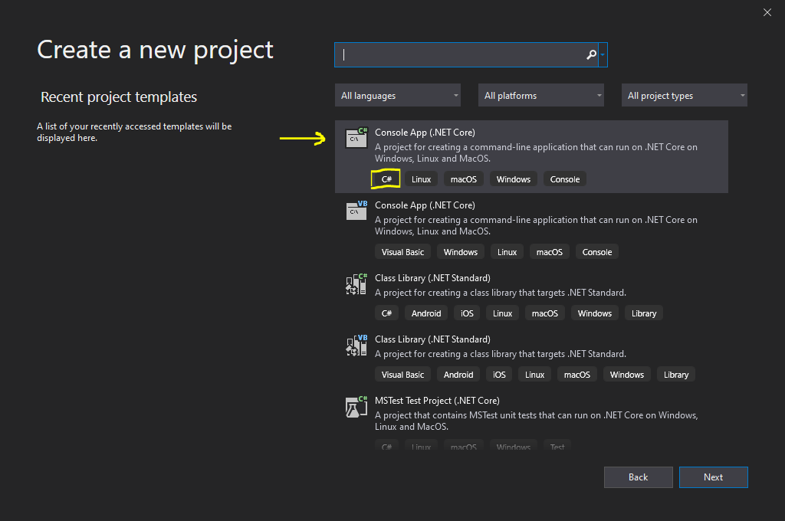
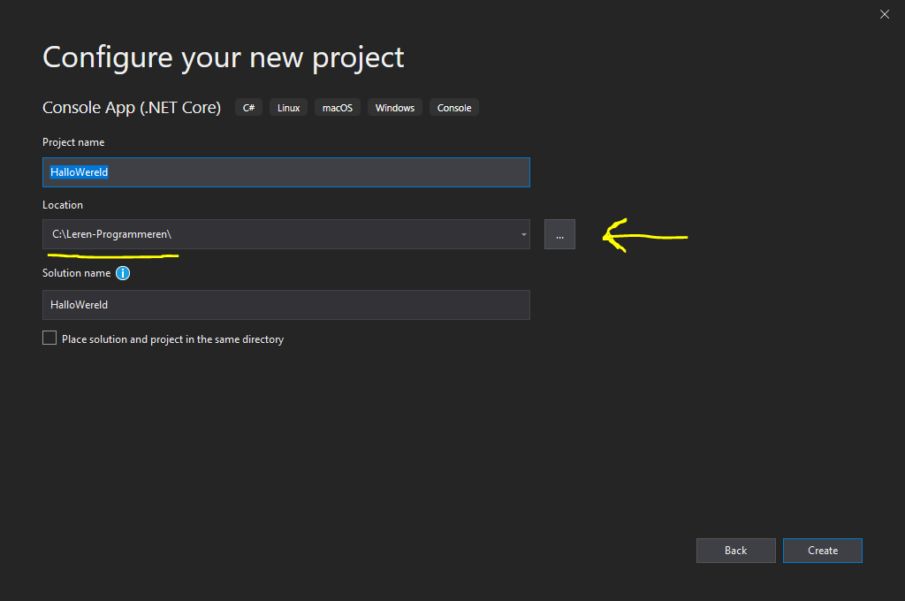

_**Note:** This repos contains a work instruction for children to learn how to program. It is written in Dutch so the children are able to undertand._

# Leren programmeren voor kinderen


## Werkbeschrijving

Als je deze werkbeschrijving uitgeprint hebt maar je vindt het makkelijker om op de computer ook te kunnen gebruiken dan kan je naar de volgende website om via internet te bekijken:  
https://tinyurl.com/LerenProgrameren  
of  
https://github.com/jjherscheid/leren-programmeren  

In deze document wordt uitgelegd hoe programmeren werkt. Nadat je deze werkinstructie hebt gevolgd zou je zelf een beetje kunnen programmeren.
Het doel is om kinderen enthousiast te maken voor het vak programmeren.

## Woorden die je moet leren

- **Applicatie** is het programma wat je gaat maken.
- **Input** is informatie die een applicatie in gaat, dit zijn bijvoorbeeld de letters die je intyped.
- **Output** is informatie die een applicatie uit gaat, dit zijn bijvoorbeeld de teksten die de applicatie op het scherm zet.

## Wat gaan we leren?

Programmeren is iets wat je in stappen moet leren, daarom is deze werk instructie ook opgedeelt in een aantal stappen. Dit is gedaan met het idee dat jezo van een makkelijke applicatie naar een wat moeilijkere applicatie kan groeien.
Ik wil je meenemen in de volgende soort applicaties:

1. **Hallo wereld**  
    _Dit is altijd een programma waarmee begonnen wordt als je leert programmeren. Het is een simpele applicatie waar je leert dat een applicatie **input** en **output** heeft._    
2. **Rekenmachine**  
    _Je gaat een eigen rekenmachine maken. Ook hierbij is het weer belangrijk om te snappen wat **input** en **output** is._ 
3. **Spoken spel**  
    _Met de informatie die je in _Hallow wereld_ hebt geleed ga je nu een eerste spelletje maken. Dit spelletje is nog heel simpel maar het bevat al een aantal belangrijk dingen die je moet snappen bij het programmeeren._
4. **Blaffende honden**  
    _Bij het progammeren is het belangrijk om te weten van objecten zijn en kunnen. In deze opdracht ga je hiermee spelen en leer je hier meer over._
5. **Snake**  
    _Nu ga je het echte werk doen. We gaan een echt spel maken. In het begin zal je veel moeten doen wat niet echt op programmeren lijkt. Maar uiteindelijk zal je zelf moeten programeren hoe snake werkt._  

## Verschillende programmeer talen

Er zijn een heleboel verschillende programmeertalen. Het is eigenlijk haast niet mogelijk om die allemaal te kennen. Een aantal van de belangrijkste programmeertalen zijn:
* Javascript
* HTML/CSS
* Python
* Java
* C#
* Scratch

Waarom zijn er nu zoveel verschillende programmeertalen vraag je je misschien af. Elke taal is uitgevonden omdat mensen een andere taal minder goed vonden. Maar ook zijn sommige talen geschikt om websites mee te maken en andere juist weer om applicaties mee te maken. Als je eenmaal een programmeertaal goed kent dan is het vaak ook minder lastig om een andere taal te leren.

Omdat we toch een keuze moeten maken kiezen we in deze werkbeschrijving voor C#. Wil je liever in Python en/of Scratch programmeren dan is misschien het boek "Programmeren voor kinderen" wel een leuk boek om te kopen.

## Wat heb je nodig?

### Computer

Om te leren te programmeren heb je natuurlijk een computer nodig waarop je kan en mag programmeren. Voor het maken van kleine applicaties heb je helemaal niet zo veel nodig. Vraag wel je ouders even of je op de computer mag programmeren en of ze je willen helpen met het instaleren van de programma's die je nodig hebt.

### Programma om in te programmeren

1. Visual Studio Community 2019 _(Voor de stappen 1 t/m 4)_  
_Hiermee kan je programma's in C# mee maken. Je kan deze downloaden bij Microsoft: https://visualstudio.microsoft.com/vs/community/_
2. Unity (Gratis editie) _(Voor stap 5)_  
_Hiermee kan je games programmeren. Je kan deze downloaden bij Unity: https://store.unity.com/products/unity-personal_
3. Unity account  _(Voor stap 5)_
_Maak zelf of laat een ouder iemand een gratis account aanmaken bij https://unity.com/_


### Ruimte op je computer

Het is handig om een vaste plek op je computer te hebben waar je de bestanden neer kan zetten. In alle voorbeelden ga ik er vanuit dat er een mapje op de computer is waar je de bestanden neer mag zetten. Als je niet weet hoe het werkt moet je misschien even aan papa of mama vragen of ze op de computer een mapje aanmaken. Voor de voorbeelden is het het makkelijkst als er een mapje is op de volgende plek:

* C:\\Leren-Programmeren\

_**Let op:** Als je een andere plek gebruikt voor je bestanden dan moet je in de voorbeelden die gegeven wordt even zelf in de gaten houden dat je het op de goede plek neerzet._

## Beginnen met programmeren

Laten we nu maar eens echt beginnen met programeren. Voor de eerste stappen hebben we alleen 'Visual Studio' nodig. 

# Applicatie 1: Hallo Wereld

## Project aanmaken

Laten we gaan beginnen met 'Hallo wereld'. Dit is een kleine applicatie die deze tekst laat zien wanneer je het opstart. Ook gaan we nog wat aanpassingen doen zodat de applicatie weet wie jij bent en dat hij jou (of iemand anders) ook gedag kan zeggen.

1. Start Visual Studio op door in het start-menu van Windows te zoeken naar _Visual Studio_ en dan op Enter te drukken  


2. Maak een nieuwe applicatie aan door te kiezen voor 'Create a new Project'  


3. In het venster wat er nu staat kies je voor 'Console App (.NET Core)' en klik je op de knop 'Next'   
_Let op dat je voor degenen kiest waar ook C# bij staat_


4. Nu moet je de naam in vullen voor je project en ook waar je het project wilt opslaan.  
    - Geef je project de naam 'HalloWereld'.
    - En kies voor de juiste locatie door op het knopje te drukken en dan de map op te zoeken waar de bestanden moeten komen te staan. In ons geval is dat _C:\Leren-Programmeren_, en druk dan op 'Select Folder'.
  
    - Als alles goed staat zoals op het plaatje, klik dan op 'Create'

Nu is er een project aangemaakt waarin we kunnen gaan werken. Als het goed is zie je in Visual Studio dit:  


Er zijn hier nu 3 delen die belangrijk zijn om te snappen.

1. Het grootste gedeelte is waar de code geschreven wordt. Hier worden bestanden geopend en hier kan je de code echt gaan typen.
2. Elk betand wat je opent wordt als tab getoond boven het grote gedeelte.
3. Rechts op je scherm zie je de 'Project boom'. Hierin staan alle bestanden die je aanmaakt voor je project. Voor nu zullen we het nog even simpel houden met maar één bestand.

### Wat heb je nou eigenlijk gedaan?

Ik hoop dat het allemaal gelukt is en dat je nu ook ziet zoals het plaatje van hierboven. Maar misschien is het handig om even een korte uitleg te geven van wat je net gedaan hebt.

Als je in C# wilt programmeren dan heb je een 'project' nodig. In dit project zit alle code die je schrijft lekker bij elkaar. Als je dit project dan uiteindelijk opstart (wat we later gaan doen) dan wordt dat de applicatie die we gaan bouwen.

In dit geval hebben we gekozen voor een 'Console App (.NET Core)' applicatie. Dat betekend dat we een applicatie gaan maken die draait een zwart schermpje met witte letters. En dat het gemaakt is met de nieuwste versie van C#.

## Project openen

Misschien wil je gelijk door, maar misschien moet je ook alweer stoppen omdat je iets anders moet gaan doen. Daarom laat ik je in dit hoofdstuk even zien hoe je het project weer kan openen als je hem gesloten hebt.

1. Start Visual Studio op door in het start-menu van Windows te zoeken naar _Visual Studio_ en dan op Enter te drukken  


2. Open je eerder gemaakte project door er op te klikken aan de linkerkant in het start scherm van Visual Studio.  


3. Als je project er niet meer bij staat, klik dan op de knop 'Open a project or solution' aan de rechterkant van het schermpje.

## Project starten

Zullen we nu eindelijk eens wat gaan doen aan de code... ;-).
Kom laten we gaan beginnen. 

Als het goed is heb je nu het project open in Visual Studio en kijk je naar het bestand 'Program.cs'. Dit is het opstart bestand voor onze applicatie en de code ziet er zo uit:
```cs
using System;

namespace HalloWereld
{
    class Program
    {
        static void Main(string[] args)
        {
            Console.WriteLine("Hello World!");
        }
    }
}
```

Laten we eerst eens gaan kijken wat het doet en dan wordt het daarna stap voor stap uitgelegd.  
Als je op 'F5' drukt (een van de knoppen boven je toetsenbord) dan gaat Visual Studio de code die geschreven is bouwen en daaruit komt dan een applicatie. Dus druk nu maar eens op 'F5'.

Als het goed is zie je nu een zwart venster met daarin de tekst 'Hello world!' wat engels is voor 'Hallo wereld!'.  
_De rest van de tekst in het zwarte scherm moet je maar even niet op letten_


Druk op een toest om het venster weer te sluiten.

**Gefeliciteerd!!** :tada: Je hebt je eerste applicatie gemaakt.

Maar... we gaan nu natuurlijk uitleggen wat het is en nog wat kleine aanpassingen maken ;-)

### Uitleg

In dit gedeelte probeer ik stukje voor stukje uit te leggen wat er in de code staat geschreven.

```cs
 using System;
```
Het eerst wat er in de tekst staat zijn 'using' stukjes. Dit zal je nog veel meer gaan zien. Dit noem je verwijzingen naar al eerder gemaakte code (bibliotheken).  
In dit geval wordt er aangegevn dat wij dingen willen gebruiken uit de 'System' bibliotheek, en dit hebben we nodig voor de andere code.

```cs
namespace HalloWereld
{
    ...
}
```
Hiermee maken we zelf een stukje bibliotheek wat iemand anders weer zou kunnen gebruiken. We zeggen hiermee: "Alles wat tussen de '{' en de '}' in staat dat hoort allemaal bij 'HalloWereld'.

_Als iemand een stukje van onze code zou willen gebruiken in een andere applicatie dan zou dat kunnen door `using HalloWereld` boven zijn code te zetten._

```cs
class Program {
    ...
}
```
In C# is alle code opgedeelt in stukjes die wat code kunnen uitvoeren. Die stukjes noem je een `class`. Eigenlijk kan je dit zien als een bouwblokje van LEGO. En al die bouwblokjes bij elkaar maken één applicatie.

```cs
static void Main(string[] args)
{
    ...
}
```
Dit stukje noem je een functie. En een functie bevat code die wordt uitgevoerd wanneer het wordt aangeroepen. Deze functie is wat speciaal omdat het `Main(...)` heeft. 'Main' mag maar een keer voorkomen in je applicatie is die wordt aangeroepen wanneer je de applicatie start.
_(Later wordt er meer uitgelegd over functies)_

```cs
Console.WriteLine("Hello World!");
```
En dan het (voor nu) belangrijkste stukje code van de applicatie. Deze code staat in de 'Main' functie en wordt uitgevoerd. Maar wat doet het nu precies.

`Console` is het zwarte scherm wat opstart wanneer je 'F5' klikt. En met `WriteLine` vertel je de applicatie dat je een regel wilt schrijven op het zwarte scherm. _('WriteLine' is engels voor 'SchrijfRegel')_
De tekst die tussen " staat is de tekst.  

## Project aanpassen

### 1. Nederlands maken

Nu wordt het tijd om de code eens aan te passen. 

* Pas de tekst aan naar een Nederlandse tekst.
    ```cs
    Console.WriteLine("Hallo wereld!");
    ```
* Druk nu op F5.  
_Als het goed is krijg je weer eenzelfde scherm als bij de vorige keer, maar nu met nederlandse tekst. Gaaf he :D._

### 2. Input en output

Het schrijven van een applicatie naar het zwarte venster noemen we 'output'. Dat is een engels wordt voor 'er uit komen'. Maar het zou ook leuk zijn als we zelf (tijdens dat de applicatie aanstaat) wat er in kunnen schrijven. Dat noemen we 'input'.

* Voeg de volgende regels toe onder de 'Hallo wereld!' regel code. Let op dat bij de 3e regel er een $ in de tekst staat. Die is nodig anders werkt het niet om 'naam' goed te tonen.
    ```cs
    Console.WriteLine("Wie ben jij:");
    var naam = Console.ReadLine();
    Console.WriteLine($"Hallo {naam}");
    ```
* Druk op F5  
_Nu zie je weer het zwarte scherm maar wordt er gevraagd om je naam in te toetsen._  

* Vul je eigen naam in en druk op 'Enter'
* In het scherm staat nu 'Hallo' met jou ingevulde naam erachter.

De hele code ziet er als het goed is nu zo uit:
```cs
using System;

namespace HalloWereld
{
    class Program
    {
        static void Main(string[] args)
        {
            Console.WriteLine("Hallo wereld!");
            
            Console.WriteLine("Wie ben jij:");
            var naam = Console.ReadLine();
            Console.WriteLine($"Hallo {naam}");
        }
    }
}
```

In de code zie je drie keer `Console.WriteLine(...)` staan. Dit is dus de 'Output'. Ook zie je één keer `Console.ReadLine()` staan. Met deze regel wacht de applicatie totdat je wat hebt ingetypd en op 'Enter' hebt gedrukt. Dus is dus de 'Input'.

Andere manieren om te schrijven of de lezen zijn nog:
- `Console.Write(...)` die gebruikt kan worden om iets op het scherm te zetten zonder naar een nieuwe regel te gaan.
- `Console.ReadKey(...)` die gebruikt kan worden om iets te lezen zonder dat de 'Enter' toets ingedrukt wordt.

### 3. Problemen opsporen

Het kan wel eens voorkomen dat je programma niet goed doet wat je wilt dat hij doet. Dan is het handig om stap voor stap te kunnen zien wat er gebeurt. Dat noemen we in programmeertaal 'Debuggen'.  

#### Breakpoint

Om stap voor stap te kunnen mee kijken is het nodig om een 'breakpoint' aan te maken. Hiermee geef je aan waar de applicatie moet stoppen en vanaf daar kan je dan mee kijken. In onderstaande plaatje is een 'breakpoint' geplaatst op regel 12. Dit kan je doen door met je muis te klikken op de balk voor het regelnummer (waar in het plaatje het rode bolletje staat).  


#### Debuggen

* Druk nu op F5. Het programma start weer en vraagt naar je naam. Maar voordat je wat kan invullen wordt in Visual Studio het volgende getoond:  
.

* Het programma staat nu eigenlijk gewoon stil en doet niks meer. Maar als je nu (in Visual Studio) op 'F10' klikt dan vertel je daarmee aan Visual Studio dat je een regel verder wilt.  
Er lijkt nu niks te gebeuren maar als je nu het venster van de applicatie weer opent (staat onder in de balk ergens) dan kan je gewoon weer verder.  
* Vul nu je naam weer in en druk op Enter.
* Nu wordt in Visual Studio de volgende lijn geel gemaakt en wordt de applicatie weer gestopt.  

* Ga met je muispijltje over de tekst `{naam}`.
Je kan nu de waarde zien van wat er in 'naam' zit.  

* Druk weer op F5 en de applicatie gaat gewoon weer verder.

Nu heb je gezien dat je met 'breakpoints' je code still kan zetten op sommige momenten, en dat je dan kan zien welke waardes er op dat moment in zitten.

### 4. Zelf uitbreiden

Nu heb je voor het eerst zelf een stukje C# code geschreven. Vind je het al leuk? Ik hoop het wel ;-).   
Het is nog leuker om zelf wat meer er mee te doen. Daarom de volgende (kleine) opdracht. We gaan daarom niet alleen vragen naar de naam van de persoon die onze applicatie gebruikt maar we willen nog wat meer informatie weten. Dus maak het volgende:
1. Vraag ook naar de leeftijd en laat het daarna zien
2. Vraag waar iemand woont en laat het daarna zien.

Is het gelukt? Super leuk! Gefeliciteerd :tada:

# Applicatie 2: Rekenmachine

Laten we nu proberen een iets lastigere applicatie te maken. De basis dingen heb je nu geleerd bij 'Hallo wereld'. Maar ik zal in stappen uitleggen wat je moet doen, maar het kan soms zijn dat er iets minder plaatjes staan.

_Als 'Hallo wereld!' nog open staat, dan mag je die sluiten. We gaan namelijk een nieuwe applicatie maken._

## Project aanmaken

Laten we gaan beginnen met 'Rekenmachine'. Dit is een kleine applicatie waarmee je simpele berekeningen moet kunnen gaan doen.

1. Start Visual Studio op door in het start-menu van Windows te zoeken naar _Visual Studio_ en dan op Enter te drukken  


2. Maak een nieuwe applicatie aan door te kiezen voor 'Create a new Project'  


3. In het venster wat er nu staat kies je voor 'Console App (.NET Core)' en klik je op de knop 'Next'   
_Let op dat je voor degenen kiest waar ook C# bij staat_


4. Nu moet je de naam in vullen voor je project en ook waar je het project wilt opslaan.  
    - Geef je project de naam 'Rekenmachine'.
    - En kies voor de juiste locatie door op het knopje te drukken en dan de map op te zoeken waar de bestanden moeten komen te staan. In ons geval is dat _C:\Leren-Programmeren_. Als je de map zoekt dat ziet de map er zo uit als op het plaatje, en kies dan voor 'Select Folder'.
      
    
    - Als alles goed staat zoals op het plaatje hierboven, klik dan op 'Create'

Nu is er weer een nieuw project aangemaakt waarin we kunnen gaan werken. Als het goed is zie je in Visual Studio weer hetzelfde als bij de eerste applicatie. En staat er weer:
```cs
Console.WriteLine("Hello world!");
```

Klopt dit? Mooi zo, dan ben je goed bezig!

Laten nu dan beginnen met het bedenken wat een rekenmachine moet doen en wat voor sommen we willen dat hij kan uitrekenen:

* De rekenmachine moet getalen kunnen optellen en aftrekken.

Oh.. is dat alles? Dat klint eigenlijk helemaal niet zo moeilijk...

Nou.. dan gaan we gewoon beginnen, vindt je ook niet ;-).

1. Verander in regel 9 de tekst 'Hello World!' in 'Dit is een rekenmachine'
    ```cs
    Console.WriteLine("Dit is een rekenmachine");
    ```
2. Nu gaan we vragen aan de gebruiker van de rekenmachine wat het eerste getal moet zijn wat gebruikt worden in de berekening. Weet je nog hoe je iets moest vragen aan iemand? ... Juist `Console.ReadLine()`. Zet dus het volgende neer:
    ```cs
    Console.WriteLine("Wat is het eerste getal?");
    var eersteGetal = Console.ReadLine();
    ```
    In de stap hierboven lees de applicatie wat de gebruiker in typed en zet dat weer in de variabele 'eersteGetal'. Misschien denk je nu 'variabele', wat is dat nou weer. In de eerste opdracht heb je ze ook al gebruikt. Een variabele is een stukje geheugen in de computer waar je informatie in kan zetten en uit kan halen. Hier is de variable 'eersteGetal'. De computer lees namelijk wat de gebruiker in typed en zet dat daarna in het stukje geheugen dan 'eersteGetal' heet. Later ga je dit er weer uit halen om mee te berekenen.

3. Ok, we hebben het eerste getal. Dus nu willen we weten of de gebruiker wil optellen of aftrekken.
    ```cs
    Console.WriteLine("Wil je optellen of aftrekken (+ of -)");
    var plusOfMin = Console.ReadLine();
    ```

4. Nu gaan we ook het laatste getal vragen. Zou je al weten hoe dat moet?
    ```cs
    Console.WriteLine("Wat is het tweede getal?");
    var tweedeGetal = Console.ReadLine();
    ```

    We hebben nu alle informatie om de som op te lossen in variabelen gestopt. Weet je nog wat de variabelen zijn? ... Juist...'eersteGetal', 'plusOfMin' en 'tweedeGetal'.

5. Laten we eerst de som een op het scherm zetten:
    ```cs
    Console.WriteLine($"De som: {eersteGetal}{plusOfMin}{tweedeGetal}= ");
    ```

    Nu weten we dus dat de goede dingen in de variabelen staan. Alleen hebben we nog geen uitkomst. Om dat te maken is het handig om gebruik te maken van een eigen gemaakte functie. Dat moeten we dus eerst even uitleggen.

    ### Functies

    Een functie is een stukje herbruikbare code. Dus ander gezegd code die je op een andere plek nog een keer zou kunnen gebruiken. Een functie doet vaak iets waarvan het handiger is om het even los te programmeren.  
    In de afgelopen opdrachten heb je al gebruik gemaakt van functies, misschien wel zonder dat je het doorhad. Namelijk:
    ```cs
    Console.WriteLine(...)
    ```
    Hierbij is `WriteLine` de functie die aangeroepen is. Je ziet misschien ook gelijk dat het handig is dat er een functie is, want anders hadden we elke keer waar we `WriteLine` hebben geschreven zelf code moeten schrijven om tekst op het scherm te krijgen.

    #### Parameters

    Een functie **kan** parameters hebben. Dat zijn eigenlijk de gegevens die je mee stuurt wanneer je de functie aanroept. In het geval van `WriteLine` is het de tekst die je op het scherm wilt zien. Een functie kan meerdere parameters hebben, maar het hoeft niet.

    #### Return waarde (vertaald: teruggeef waarde)

    Een functie **kan** een return waarde hebben. Dat betekend dat wanneer de functie wordt aangeroepen dat er informatie terugkomt waar je weer wat mee kan doen. Ook die heb je al gebruikt. Kijk maar eens naar de plekken waar je `Console.ReadLine()` hebt gebruikt. Deze functie heeft zoals je ziet _geen_ parameters, maar elke keer wanneer we hem aanroepen dan zetten we er een variabele voor. Bijv:  
    ```cs
    var tweedeGetal = Console.ReadLine();
    ```
    In dit geval komt er dus uit de functie een return waarde waarin staat wat de gebruiker heeft ingetyped op het scherm. Wij zetten die waarde die terugkomt uit de functie gelijk in een variabele _tweedeGetal_ (weet je nog wat dat is? Juist.. en stukje computer geheugen).

6. We gaan een functie maken! Zet daarom de functie `Bereken` tekst onder de functie `Main()`. De functie `Bereken` ziet er zo uit:

    ```cs
    static int Bereken(int getal1, int getal2, string plusOfMin)
    {
        return 0;
    }
    ```
    Als je hem op de goed plek zet dan zie je bestand er nu ongeveer zo uit zoals hieronder.
    ```cs
    using System;

    namespace Rekenmachine
    {
        class Program
        {
            static void Main(string[] args)
            {
                // Hier staat bij jou een heleboel code all
                // ....
            }

            static int Bereken(int getal1, int getal2, string plusOfMin)
            {
                return 0;
            }
        }
    }
    ```

    Maar nu is natuurlijk de vraag.. Wat heb je nou neer gezet. Er zitten weer allemaal nieuwe dingen die je nog niet eerder gezien hebt. Hieronder leg ik uit wat het betekend.

    Weet je nog dat we het hebben gehad over _Parameters_? Ja.. Goed zo. Nou in de `Bereken` functie zitten 3 parameters: _getal1_, _getal2_ en _plusOfMin_. Ook heeft de functie een _Return waarde_. Zie jij hem al?...
    Goed zo.. De Return waarde van deze functie is nu '0'. Dat gaan we straks natuurlijk wijzigen want een Rekenmachine die alleen maar 0 teruggeeft is niet heel handig ;-).

    Maar wat is dan _static_, _int_ en _string_. Die zie je ook vast staan in de functie. _static_ laten we even zitten want dat is voor nu niet belangrijk. De _int_ en _string_ zijn wel belangrijk. Dit noem je **types**, je geeft daarmee aan wat voor soort geheugen stukje de computer moet gebruiken voor je parameter. 
    Er zijn een aantal belangrijks **types** die handig zijn om te onthouden:
    * int = een stukje geheugen waarin je een getal kan zetten. Dit kan alleen een getal zijn wat geen cijfers achter de komma heeft.
    * double = een stukje geheugen waarin je ook een getal kan zetten. Deze heeft juist wel cijfers achter de komma.
    * string = een stukje geheugen waarin je tekst kan neer zetten. Strings worden altijd in code geschreven met dubbele quotjes, dat zijn deze ". Dit heb je eerder gezien in bijvoorbeeld de `Console.WriteLine("Wat is het eerste getal")`. Als je voor de eerste " een $ zet dan kan je variabelen (weet je nog wat het is?) gebruiken in je tekst en dan worden die ook automatisch tekst zoals in `$"Hallo {naam}"`. De variable _naam_ wordt dan in de tekst gebruikt.
    * bool = een stukje geheugen waarin je _waar_ of _niet waar_ kan zetten. Dit is alleen engels dus dat is het _true_ (waar) en _false_ (niet waar).

    Als we dan nu weer kijken naar de functie die we aan het maken zijn dan zie je dat er dus 2x een nummer en 1x een tekst als parameter wordt meegegeven. Zie je dat? Ja? Goed zo... Maar als je het toch niet ziet hier een beetje extra uitleg.  
    _getal1_ en _getal2_ zijn allebei van het type _int_, dit zijn dus nummers. _plusOfMin_ is van het type _string_, dit is dus een stukje tekst waarin we mee gaan geven of de rekenmachine '+' of '-' moet gaan doen.

    Nu is je misschien al opgevallen dat er nog een keertje _int_ staat, maar dan voor de `Bereken` functie. Dit zorgt er voor dat de computer snapt dat je ook een nummer terug wilt geven als Return waarde.

    Nou laten we nu maar eens echt beginnen met het vullen van de functie, vind je ook niet :D.

7. We gaan nu de functie vullen met echte code! Jippie :tada:. We gaan eerst zorgen dat de functie 2 getallen kan optellen.
    ```cs
    static int Bereken(int getal1, int getal2, string plusOfMin)
    {
        return getal1 + getal2;
    }
    ```
    Zo.. dat was niet zo moeilijk toch? :D. Je hebt nu dus je eerste functie gemaakt die ook echt wat doet. Topper.  
    Maar we wilde natuurlijk een functie maken die optelt of aftrekt. Dus we moeten ook kijken naar wat er in _plusOfMin_ staat. Dat kunnen we doen met een _if_. 'If' is engels voor 'Als' en ziet er zo uit:
    ```cs
    if (getal1 == 10) {
        // Hier kan je wat neer zetten...
    }
    ```
    Hierboven staat eigenlijk hetzelfde als:
    ```
    Als getal1 gelijk is aan 10 dan
    ```
    En alles wat tussen de twee haakjes { } staat wordt dan gedaan als de vraag waar is.
    Dus achter het woordje _if_ staat altijd iets tussen twee 'gewone' haakjes ( ). Wat daar tussen staat wordt bekeken door de computer en als het 'waar' is dan gaat de computer het stukje code tussen de twee speciale haakjes { } uitvoeren. Als het 'niet waar' is dan wordt dat stukje code overgeslagen.

    Wat zou het betekend als er zou staan:
    ```cs
    if (getal1 == getal2) { 

    }
    ```
    Juist... hier wordt gekeken of getal1 en getal2 hetzelfde zijn. Het kan ook andersom dan zet je niet twee keer een = neer maar zet je een uitroepteken neer met een =, dus: !=. En zo heb je ook nog 'groter dan' (>) en 'kleiner dan' (<)
    ```cs
    if (getal1 != getal2) {
        // Dit wordt door de computer uitgevoerd als de getallen niet hetzelfde zijn.
    }

    if (getal1 < getal2) {
        // Getal1 is kleiner dan getal2
    }

    if (getal1 > getal2) {
        // Getal1 is groter dan getal2
    }
    ```

    Ok nu eindelijk weer naar de echte code. Zorg er voor dat de functie er nu zo uit ziet:
    ```cs
    static int Bereken(int getal1, int getal2, string plusOfMin)
    {
        if(plusOfMin == "+") {
            return getal1 + getal2;
        }

        if(plusOfMin == "-") {
            return getal1 - getal2;
        }

        return 0;
    }
    ```

    Heb je een beetje een idee wat het doet? Als het goed is zou je het nu een beetje moeten kunnen lezen. Maar om je nog steeds een beetje te helpen hieronder de uitleg:
    ```cs
    static int Bereken(int getal1, int getal2, string plusOfMin)
    {
        // Eerst wordt gekeken of in de variabele 'plusOfMin' de tekst "+" staat. 
        // Als dat zo is dan tellen we getal1 en getal2 bij elkaar op en geven dat terug
        // met de 'return' (engels voor 'teruggeven').
        if(plusOfMin == "+") {
            return getal1 + getal2;
        }

        // Als in de variable 'plusOfMin' niet de tekst "+" staat dan gaat de computer verder
        // en kijkt hier of er "-" in staat. Als dat zo is dan trekken we getal2 van getal1 af 
        // en geven dat terug met de 'return'
        if(plusOfMin == "-") {
            return getal1 - getal2;
        }

        // Als in de variable 'plusOfMin' helemaal niet "+" of "-" in stond, maar heel iets
        // anders dan geven we in dit geval 0 terug
        return 0;
    }
    ```

8. Nu gaan we de functie gebruiken vanuit de 'Main' functie. Roep daarom de functie aan voordat we de variabelen allemaal in de `Console.WriteLine(..)` gebruiken.
    ```cs
    static void Main(string[] args)
    {
        ...

        var uitkomst = Bereken(eersteGetal, tweedeGetal, plusOfMin);

        Console.WriteLine($"De som: {eersteGetal}{plusOfMin}{tweedeGetal}= ");
    }
    ```
    Je zal nu zien dat er kringeltjes onder _eersteGetal_ en _tweedeGetal_ komen. Waarom is dat nu weer? Nou dat komt door het volgende.

    Wanneer de computer aan de gebruiker vraagt wat het eerste of tweede getal is dan weet de computer niet dat het om een nummer gaat. Hij denk daarom automatisch dat het om een stukje tekst gaat. Om de computer te laten weten dat we een nummber bedoelen moeten we de _string_ (tekst) omzetten naar _int_ met een `Convert` functie (convert is engels voor omzetten).

    ```cs
    int nummer100 = Convert.ToInt32("100");
    ```

    In onze functie kunnen we het volgende doen:
    ```cs
    static void Main(string[] args)
    {
        ...

        var uitkomst = Bereken(Convert.ToInt32(eersteGetal), Convert.ToInt32(tweedeGetal), plusOfMin);

        Console.WriteLine($"De som: {eersteGetal}{plusOfMin}{tweedeGetal}= ");
    }
    ```
    Nu worden dus eerste de teksten die de computer in geheugen heeft omgezet in nummers voordat de functie er wat mee gaat doen.

9. En dan nu de laatste stap, dan is de rekenmachine klaar. We moeten de uitkomst van de som nog aan de gebruiker laten zien. Pas daarom de laatste `Console.WriteLine(...)` aan.
    ```cs
    Console.WriteLine($"De som: {eersteGetal}{plusOfMin}{tweedeGetal}={uitkomst}");
    ```

10. Druk nu maar op 'F5' en dan gaat de computer de applicatie weer bouwen en opstarten. Nu kan je testen of je applicatie werkt. 
    
    Werkt je applicatie? Ja :D. Gefeliciteerd :tada:.

    _Als je zin of tijd hebt kan je altijd proberen om de _keer_ (*) en de delen-door (/) ook nog te maken._


_**Let op**: Deze applicatie is heel 'simpel' gemaakt. En daarom is er niet gekeken of wat je intyped ook wel echt klopt. Als je dus tekst invult inplaats van een getal zal er daarom ook een fout komen en doet je applicatie het niet meer. Je kan dan altijd op de stop-knop drukken in Visual Studio_  

