# Snake werkbeschrijving

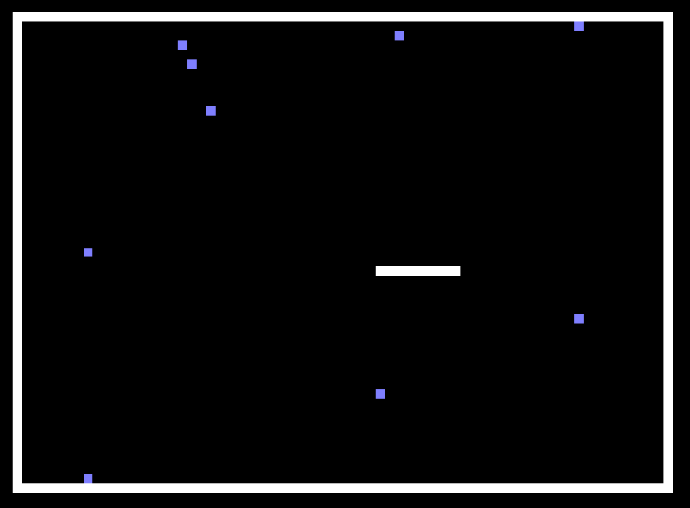

Deze snake werkbeschrijving komt heb ik niet helemaal zelf bedacht maar via een ander site op internet gevonden. Daar is hij alleen in het engels dus ik heb geprobeerd hem te vertalen.

Snake is een op zich een simpel spelletje, maar het is nog best ingewikkeld om te maken. Naast als je programmeer ervaring van de vorige opdrachten zal je hier ook met een nieuw programma aan de slag gaan, namelijk Unity. Unity is een programma waarmee spelletjes gemaakt kunnen worden voor de Computer, maar ook voor de PS4, Switch, Telefoon, Tablet etc. Het is dus een heel uitgebreid programma waar heel veel dingen ingesteld kunnen worden.

## Unity Installeren

**Let op:** Dit hoofdstuk ik alleen nodig als Unity nog niet geïnstalleerd is.

### Unity Hub installeren 

Unity Hub is eigenlijk een programma om eenvoudige meerdere versies van Unity te kunnen gebruiken en je projecten te maken/openen.

_Je kan deze downloaden bij Unity: https://public-cdn.cloud.unity3d.com/hub/prod/UnityHubSetup.exe_  
* Voer de installatie uit
* Na de installatie zie je het volgende scherm:  
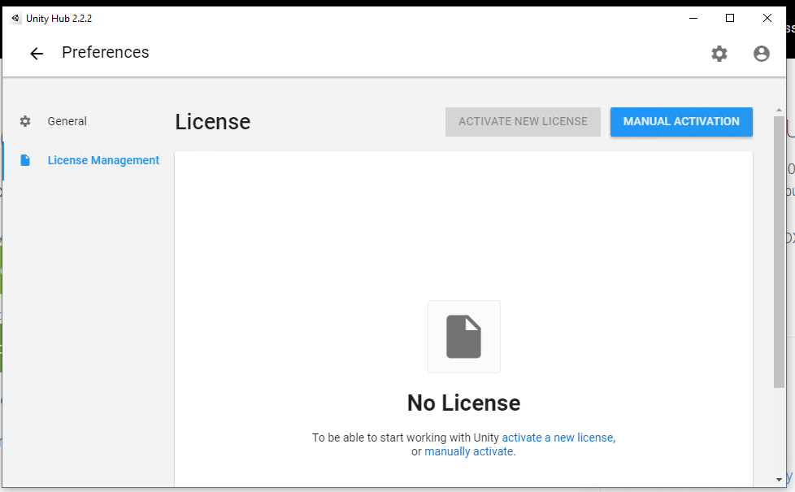
* Klik op het poppetje boven inbeeld en kies voor 'Sign In'
* Klik daar op 'Create account'  
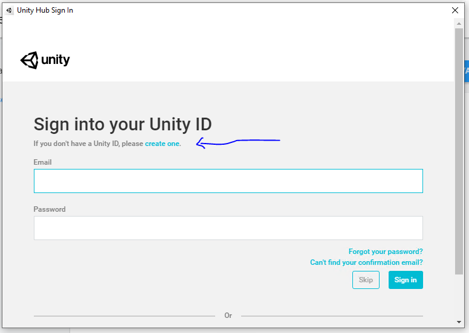
* Vul de gegevens in. (_Gebruik niet het knopje 'SignIn with Google' die werkt niet_)  

* Nadat je email gecontroleerd is kom je weer in het Unity Hub scherm. Klik daar op 'Activate New License'  
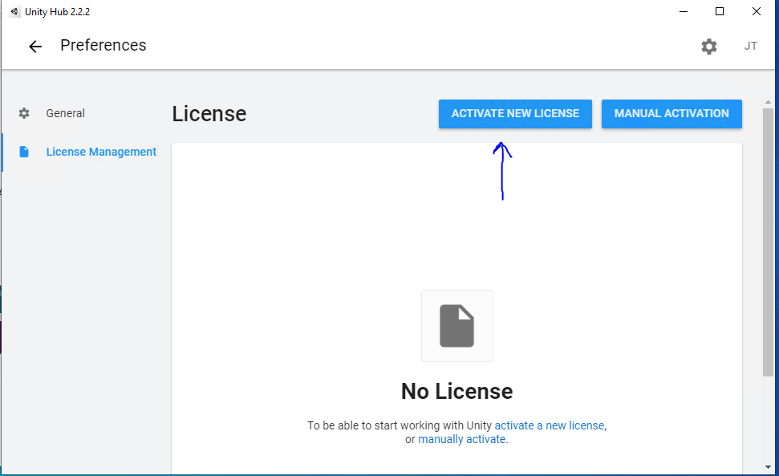
* Kies voor 'Personal' license.  
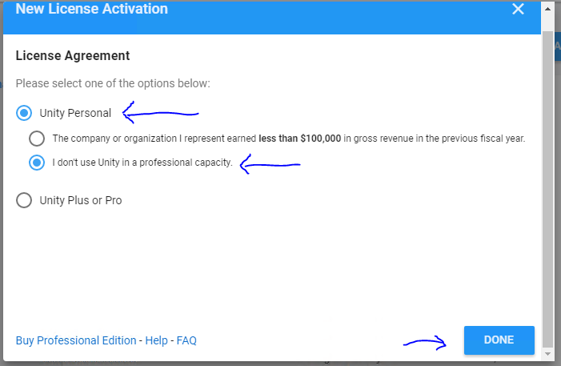
* Klik op de pijl om terug te gaan naar het hoofscherm.  
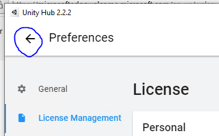

Unity Hub is nu geinstalleerd, nu moet nog de juiste versie van Unity geinstalleerd worden.

### Unity installeren (2019.2.**)

Voor dit project is verstandig om versie 2019.2.** te installeren. 

* Klik op 'Installs'  

* Klik op 'Add' om een installatie toe te voegen   
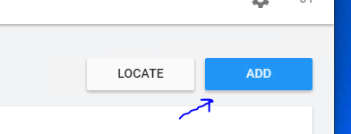
* Kies de juiste versie van Unity  
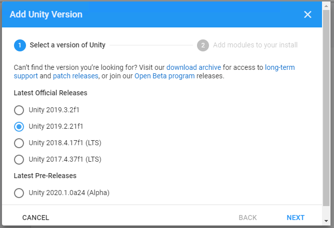
* Kies de juiste modules (standaard staat het goed)  
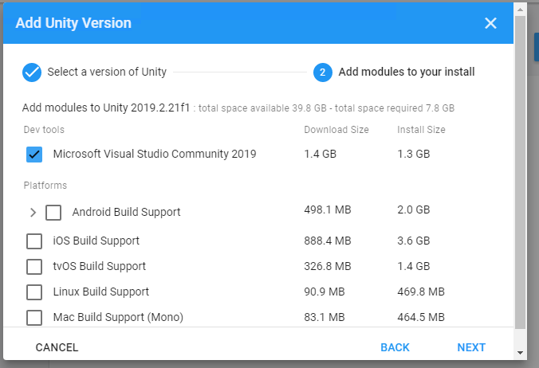
* Accepteer de voorwaarden  
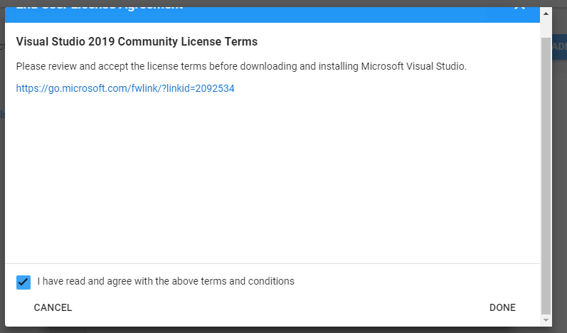
* Als het goed is zie je deze na de installatie beschikbaar onder 'Installs'  
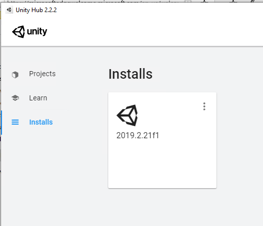

Onder het kopje 'Projects' zal je straks een project toevoegen.

## Project openen in Unity

_Omdat het best lastig is om een Unity project aan te maken, heb ik alvast een basis project aangemaakt voor een 2D spel. Ook zijn alle plaatjes die je nodig hebt ook al toegevoegd._

Laten we beginnen met het project te openen. Zoek in het Startmenu van Windows naar 'Unity Hub'.  (_Als Unity Hub al open staat hoeft dit natuurlijk niet ;-)_)
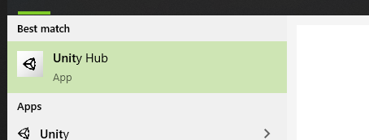

Klik in het venster wat nu in beeld staat op 'Add' (toevoegen).  
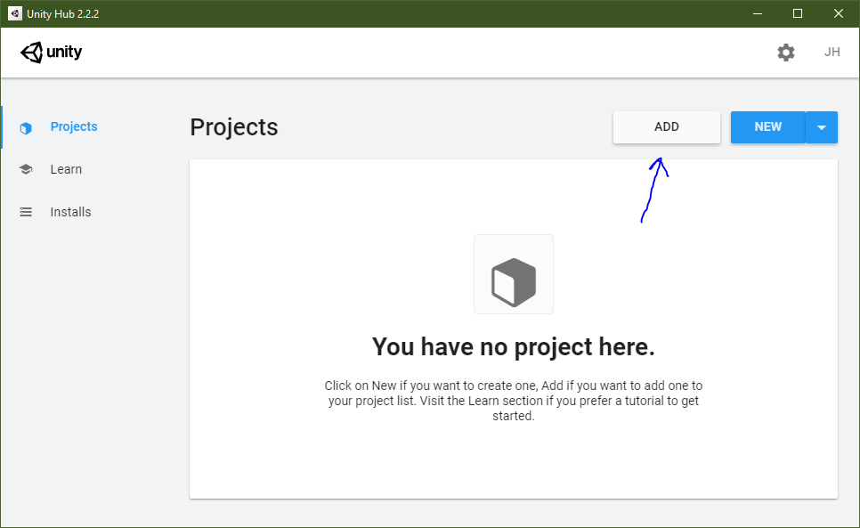

Zoek de map _C\\Leren-Programmeren\\Snake\\_ en kies voor 'Select Folder'.  
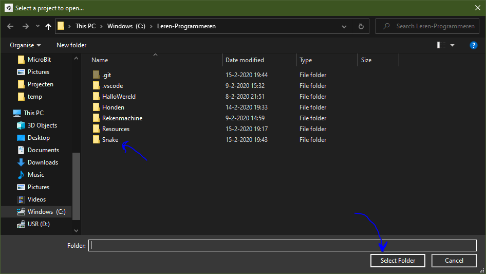

Klik in het projecten scherm nu op het zojuist toegevoegde project 'Snake'.  
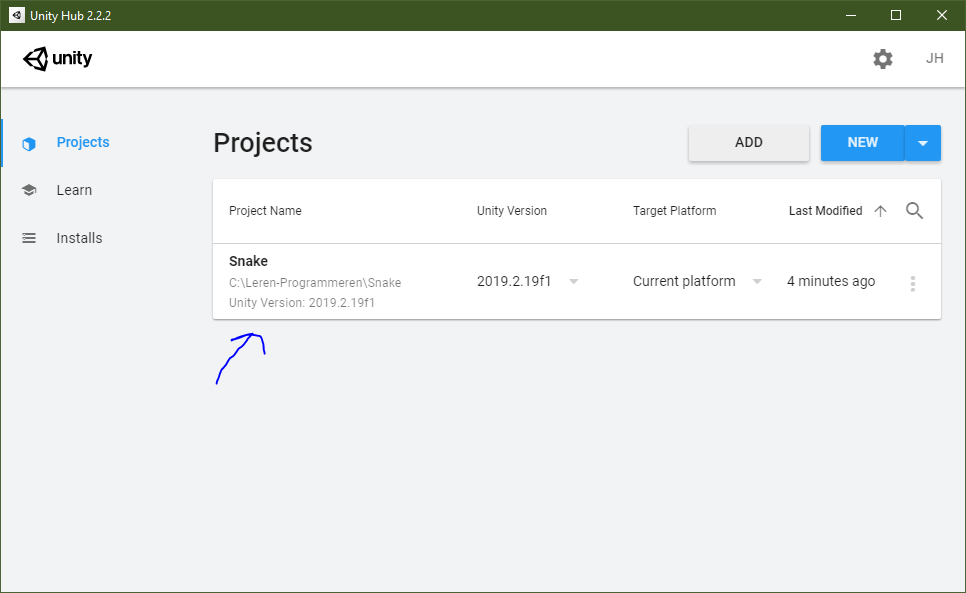

Als het goed is opent nu het volgende scherm van Unity:  


In het Unity scherm zijn een aantal dingen belangrijk:

1. Is de 'scene' selectie. Daarin hebben we op dit moment 'SampleScene' met daarin alleen een 'Main Camera'.
2. Hier kan je mapjes vinden met extra items. Handigste is om deze met de selectie op 'Assets' te laten staan.
3. Dit een een gedetailleerde weergave van een mapje wat in '2' in aangeklikt. Door in 2 op 'Assets' te laten staan zie je hier als het goed is de onderdelen die je nodig hebt voor het spel.
4. Dit is een eigenschappen venster. Wanneer je wat aanklikt in Unity kan je hier allemaal dingen aanpassen.
5. Is het venster waar je het spel echt gaat 'maken'.
6. Zijn de knopjes om het spel te testen.

_**Letop:** Als bij jou 'SampleScene' niet in het project menu (1) staat, dan is er iets niet goed gegaan. Je kan dan de 'SampleScene' vinden in venster 3 onder Assets. En die kan je slepen in venster 1._

## Toevoegen van de randen van het spel

Als eerste gaan we de randen van het spel maken. Daarvoor zijn er twee 'assets' (die plaatjes in vakje 3).
- border_horizontal
- border_vertical

Selecteer eerst de horizontale lijn in het 'Assets' venster (3).  
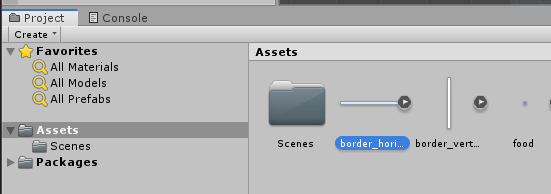

Als het goed is zie je nu in het eigenschappen venster (4) dat je een heleboel kan instellen.
Zorg ervoor dat de instelling hetzelfde zijn als op onderstaand plaatje en druk dan op 'Apply':  
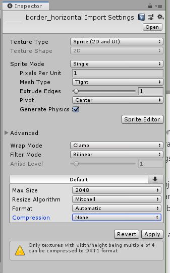

_Belangrijkste wijziging is de 'Pixel Per Unit'. Omdat de snake ook 1x1 pixel gaat zijn willen we dat elke afstand in het spel ook per 1 pixel gaat. We zullen daarom bij **alle** assets dit op **1** willen zetten._

Selecteer nu de verticale lijn in het 'Assets' venster.  
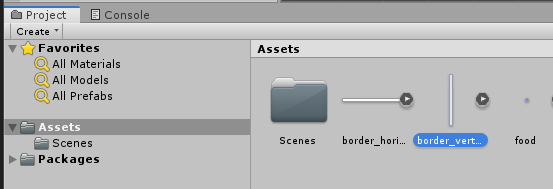

Ook hiervoor zetten we de eigenschappen hetzelfde als bij de horizontale lijn en klik weer op 'Apply':  
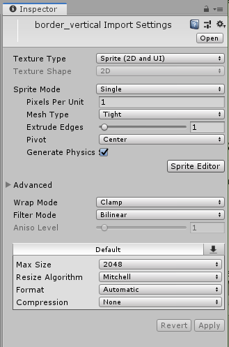

Nu kunnen we de lijnen in het spel slepen. Sleep daarom de horizonale en verticale lijn allebei 2 keer in het spel venser (5). _Als de lijn heel groot lijkt, dan kan je uitzoomen met de scroll van de muis te draaien in het spel venster. Je kan ze alvast een beetje goed zetten, maar let daar nog niet te veel op, dat gaan we zo aanpassen._  

Als je de lijnen in het spel hebt gezet dan kan je ze daarna nog verslepen. Je moet dan alleen even vastpakken bij het middelste rondje als je een lijst geselecteerd hebt.  
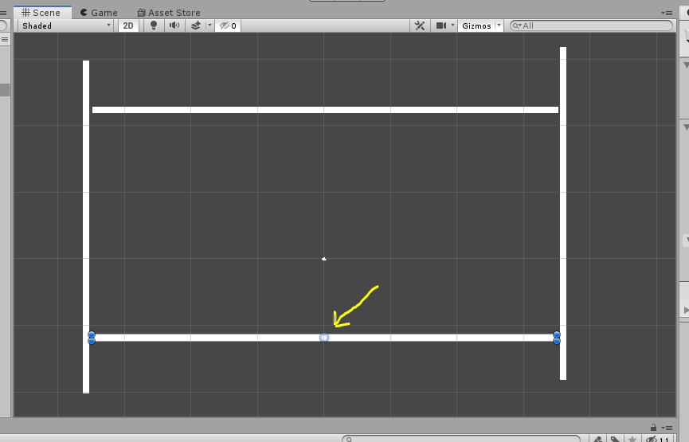

Als ze ongeveer zo staan zoals in het plaatje is het prima voor nu.  
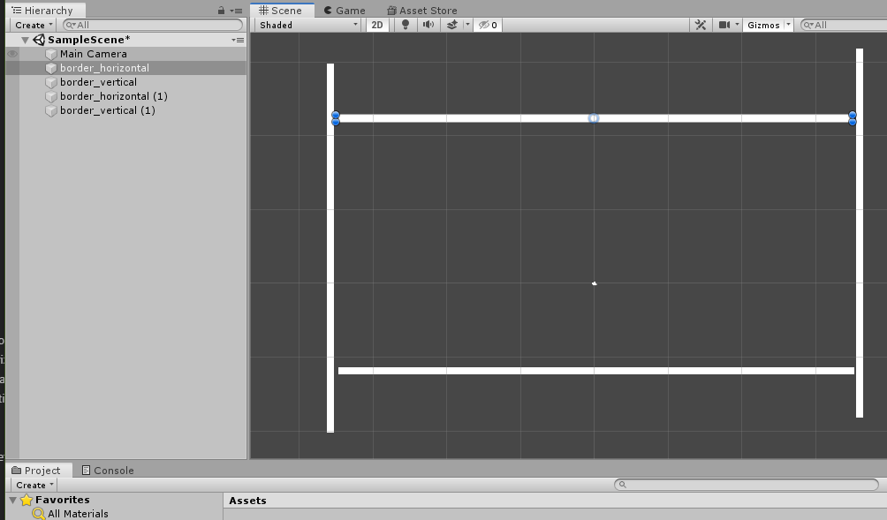

Als je een lijn selecteert dan zie je in het 'Scene' venster (1) dat deze grijs (geselecteerd) wordt. We gaan nu even handige namen geven aan de lijntjes.  
Nu kan jij ze iets anders hebben staan dan mij. Maar als je de linker verticale lijn selecteert, hernoem hem dan in het scene venster naar 'BorderLeft'.  
Het hernoemen kan je doen door in het scene venster op 'F2' te klikken of door in het eigenschappen venster de naam te wijzigen:  
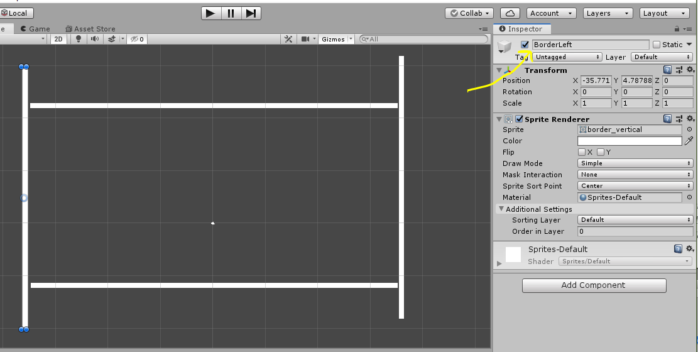

Doe dit voor alle lijntjes. Hernoem de lijntjes alsvolgt:

- linker verticale lijn = BorderLeft _(deze heb je net gedaan)_
- rechter verticale lijn = BorderRight
- bovenste horizontale lijn = BorderTop
- onderste horizontale lijn = BorderBottom

Om de lijnen op de juist plek te krijgen kan je ze één voor één aan klikken en de 'Position' aanpassen in het eigenschappen venster. Gebruik de volgende getallen voor de lijnen:

- BorderLeft: **X -34.5, Y 0, Z 0**
- BorderRight: **X 35.5, Y 0, Z 0**
- BorderTop: **X 0, Y 25, Z 0**
- BorderBottom **X0, Y -25, Z 0**

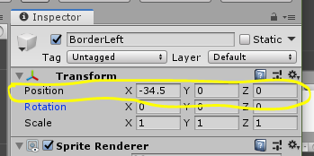

Tijd om een keertje op te slaan. Dus ga naar het menu en klik op 'Save' en doe dit nog een keer en klik op 'Save Project'.  
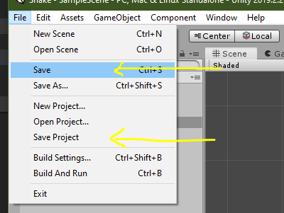

Als het goed is zie je nu de randen van het spel voor 'Snake'. Er is alleen één probleem. Hoewel deze randen er uitzien als de randen van het spel weet het spel zelf nog niet dat het echte randen zijn. We willen natuurlijk zorgen dat Snake straks niet door de rand heen kan gaan. Daarom moeten we ze onderdeel maken van de 'echte' wereld in het spel.

Om dit voor elkaar te krijgen selecteren we eerst in het scene venster alle 4 de borders.  


Op dit moment zijn voor het spel de randen dus alleen maar plaatjes, maar dat kunnen we aanpassen door in het eigenschappen venster op 'Add Component' te klikken.  
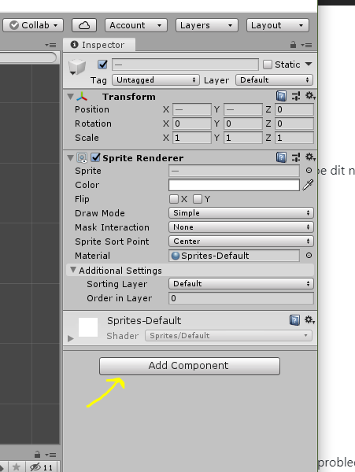

Nu open een ander venstertje en daarin selecteer je eerst 'Physics 2D' en daarna 'Box Collider 2D'. Als het goed is wordt daarna die toegevoegd aan de eigenschappen van al je randen.  
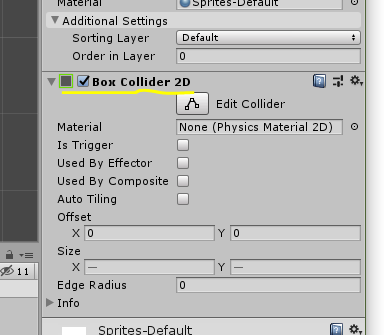

Zo.. de randen zijn nu gemaakt. En dan zonder dat je nog maar één regel code hebt geschreven. Die code komt straks echt nog wel ;-).

## Eten maken

De bedoeling van Snake is om zoveel mogelijk eten te eten en daardoor te groeien. 
Laten we daarom eerst gaan maken dat er op willekeurige plaatsen eten tevoorschijn komt.

Voor het eten is al een 'assets' (een plaatje in vakje 3).
- food

Dit plaatje is niets meer dan een gekleurde pixel. Maar dat is voor nu voldoende ;-).

Klik 'food' aan in het assets vak (3). En zorg dat de eigenschappen goed staan zoals hier, en druk daarna op 'Apply':  
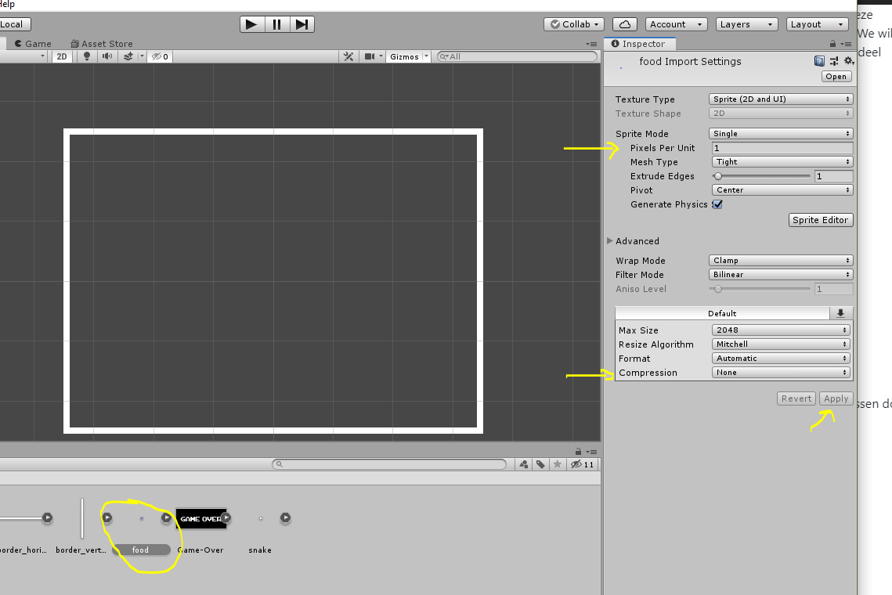

Nu kunnen we het voedsel in het spel slepen. Dat doe je door gewoon het 'food' icoontje met je muis naar het speelveld te slepen.  
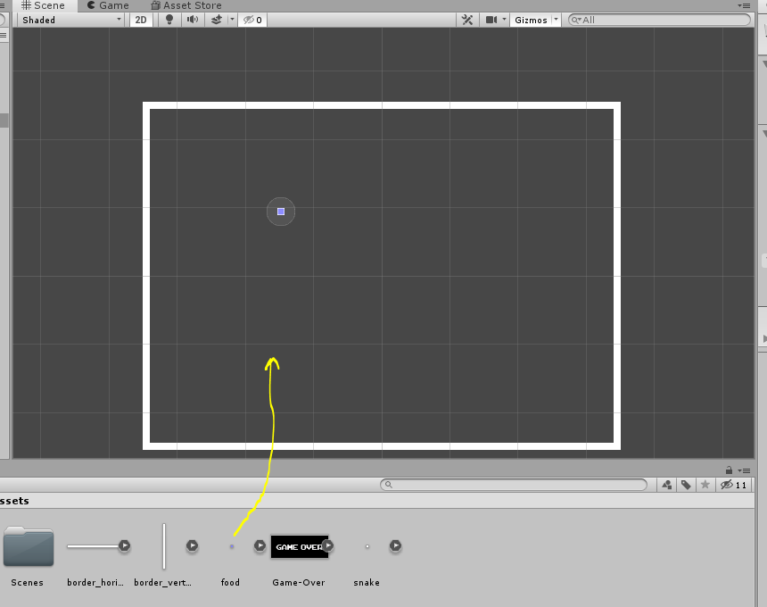

Net zoals met de randen van het spel moet Snake weten dat hij voedsel aanraakt. Daarom moeten we net als bij de randen een **Collider** toevoegen via de eigenschappen. Zorg daarom dat het eten in het spel geselecteerd is en klik in het eigenschappen venster vervolgens op **Add Component -> Physics 2D -> Box Collider 2D**.  
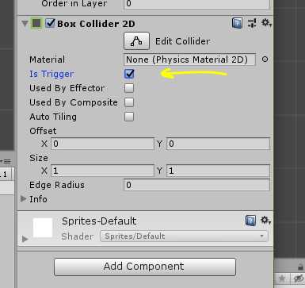

Bij de randen van het spel hoefte je niks te selecteren in het venster van de Box Collider, maar bij het eten moet je klikken op **Is Trigger**.

_**Even wat achtergrond:**  
In een spel zijn allemaal **GameObjecten**. En een **GameObject** zonder een **Box Collider** is gewoon een plaatje wat niks doet in het spel. Wanneer je wilt dat het wel wat doet in het spel dan moet je een **Box Collider** toevoegen (wat we nu 2x gedaan hebben). Door het toevoegen van de **Box Collider** wordt straks automatisch een functie (**OnCollissionEnter2D**) aangeroepen in de code wanneer een ander **GameObject** er tegenaan komt.  
Bij eten willen we niet dat Snake tegen het eten aanbotst, maar dat hij er gewoon doorheen gaat. Maar we willen wel weten als hij eten gegeten heeft. Daarom hebben we wel een **Box Collider** nodig, maar door de **Is Trigger** aan te zetten geven we aan dat de **GameObjecten** niet botsen, maar dat wel de functie (**OnCollissionEnter2D**) aangeroepen worden als ze overelkaar heen gaan._

### Prefab maken

Omdat we niet willen dat er gelijk in het begin van een spel eten klaar ligt moeten we een **Prefab** maken. Dat kan je zien als een stukje spel wat we alvast gemaakt hebben met alle goede instellingen. Zo'n **Prefab** kunnen we via code straks toevoegen aan het spel.

We gaan nu van het eten een _Prefab_ maken door eerst de naam te wijzigen naar **FoodPrefab**. Weet je nog hoe dat moet? Klik in het scene venster (1) **food** aan en wijzig in het eigenschappen venster de naam dus naar **FoodPrefab**.  
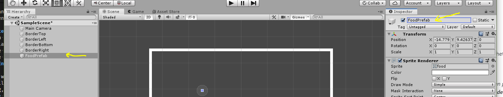

Sleep daarna de **FoodPrefab** vanuit het scene venster naar het Assets venster (3).  


Als dat gelukt is dan moet je nu uit het scene venster de **FoodPrefab** verwijderen. Hierdoor is hij nu niet meer standaard in het spel.  
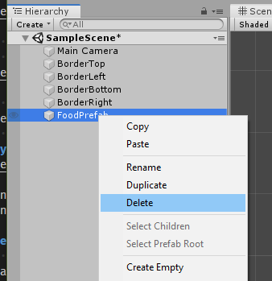

**Belangrijk:** Sla wat je gedaan weer op zoals ik eerder heb laten zien.

## Eten tijdens het spel laten onstaan

Eindelijk kan je weer wat gaan programmeren ;-). We gaan nu een script maken waarmee het eten op willekeurige plekken in het spel tevoorschijn komt.

Omdat dit script altijd er moet zijn voegen we het toe aan iets anders wat er altijd is, namelijk de 'Main Camera'. Klik daarom op de 'Main Camera'. In het eigenschappen venster klik je vervolgens op **Add Component -> New Script**.  


En noem het script 'VoedselToevoegen' en klik op 'Create and Add'.  
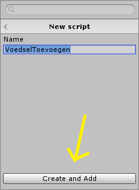

Nu is in het 'Assets' venster (3) het script toegevoegd.  
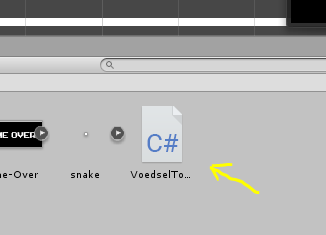

Dubbel klik op dit script en hierdoor zal Visual Studio vanzelf openen.  
In Visual Studio zie je als het goed is nu het 'VoedselToevoegen' class staan met de volgende inhoud:  
```cs
using System.Collections;
using System.Collections.Generic;
using UnityEngine;

public class VoedselToevoegen : MonoBehaviour
{
    // Start is called before the first frame update
    void Start()
    {
        
    }

    // Update is called once per frame
    void Update()
    {
        
    }
}
```

Je ziet hier 2 functies staan. **Start()** wordt aangeroepen bij het starten van het spel en **Update()** wordt de hele tijd aangeroepen tijdens het spel. Voor nu hebben we de Update() functie niet nodig dus die kan je verwijderen.  
```cs
using System.Collections;
using System.Collections.Generic;
using UnityEngine;

public class VoedselToevoegen : MonoBehaviour
{
    // Start is called before the first frame update
    void Start()
    {
        
    }
}
```

We moeten nu een variabele aanmaken voor het eten wat we willen gaan maken in het spel. Daarvoor voegen we een **GameObject** class toe en noemen die **foodPrefab**. Straks in Unity (_waar we het spel in maken_) kunnen we deze variabele aan het echte eten koppelen.

```cs
public class VoedselToevoegen : MonoBehaviour
{
    // Voor het eten
    public GameObject foodPrefab;

    // Start is called before the first frame update
    void Start()
    {
        
    }
}
```

Een **GameObject** is een heel object waar we van alles mee kunnen doen. Één van de dingen die een **GameObject** heeft is een **Transform**, dat is een ander object wat de positie bijhoudt van het **GameObject**.

_Je kan dit een beetje vergelijke met het *Huis* uit opdracht 3 die een *Hond* kan hebben_

Omdat we willen dat het eten binnen de randen gemaakt wordt moeten we weten waar de randen zijn in het spel. Daarom hebben we variabele nodig voor elke rand die in het spel zit. Nu zouden we daar ook **GameObject** voor kunnen gebruiken, maar omdat we alleen de positie willen weten gebruiker we hiervoor dus de class **Transform**. Straks in Unity kunnen we deze variabelen koppelen met de echte randen in het spel.

```cs
public class VoedselToevoegen : MonoBehaviour
{
    // Voor het eten
    public GameObject foodPrefab;

    // De randen van het spel
    public Transform borderTop;
    public Transform borderBottom;
    public Transform borderLeft;
    public Transform borderRight;

    // Start is called before the first frame update
    void Start()
    {
        
    }
}
```

Nu moeten we een functie maken die op een willekeurige plek (binnen de randen) eten aanmaakt. Hiervoor moeten we de positie in _X_ en _Y_ bepalen in het spel. _X_ is horizontaal en _Y_ is verticaal. Maak daarvoor een nieuwe functie **EtenMaken()** aan. Met de volgende code:
```cs
public class VoedselToevoegen : MonoBehaviour
{
    ...

    void EtenMaken()
    {
        // Positie van links en rechts
        var linkerRandX = borderLeft.position.x;
        var rechterRandX = borderRight.position.x;

        // Willekeurige positie tussen links en rechts
        var etenX = (int)Random.Range(linkerRandX, rechterRandX);

        // Positie van boven en onder
        var bovenRandY = borderTop.position.y;
        var onderRandY = borderBottom.position.y;

        // Willekeurige positie tussen boven en onder
        var etenY = (int)Random.Range(bovenRandY, onderRandY);
    }
}
```

_Random.Range() is een functie wat een willekeurig getal kan berekenen tussen twee andere getallen._

Nu weten we een positie voor het eten, maar moeten we het eten zelf ook nog aanmaken in het spel. Dat doen we door de functie **Instantiate()** aan te roepen (engels voor 'Aanmaken').

```cs
public class VoedselToevoegen : MonoBehaviour
{
    ...

    void EtenMaken()
    {
        // Positie van links en rechts
        var linkerRandX = borderLeft.position.x;
        var rechterRandX = borderRight.position.x;

        // Willekeurige positie tussen links en rechts
        var etenX = (int)Random.Range(linkerRandX, rechterRandX);

        // Positie van boven en onder
        var bovenRandY = borderTop.position.y;
        var onderRandY = borderBottom.position.y;

        // Willekeurige positie tussen boven en onder
        var etenY = (int)Random.Range(bovenRandY, onderRandY);

        // Aanmaken eten
        Instantiate(foodPrefab, new Vector2(etenX, etenY), Quaternion.identity);
    }
}
```

_Vector2() is een object waarmee je de positie kan aangeven. Wat een 'Quarternion' is laten we even zitten._

Nu moeten we nog zorgen dat de **EtenMaken()** functie wordt aangeroepen. Dit kunnen we doen door in de **Start()** functie een tijdklok te maken die elke keer de **EtenMaken()** functie aanroept.
```cs
void Start()
{
    InvokeRepeating(nameof(EtenMaken), 3, 4);
}
```
De **InvokeRepeating()** functie roept de functie aan die we mee geven (In dit geval dus **EtenMaken**) na 3 seconden aan. En daarna elke keer na 4 seconden. Sla het script in Visual Studio op door via het menu te kiezen voor 'Save' of via het 'Save icoontje' boven in beeld.  
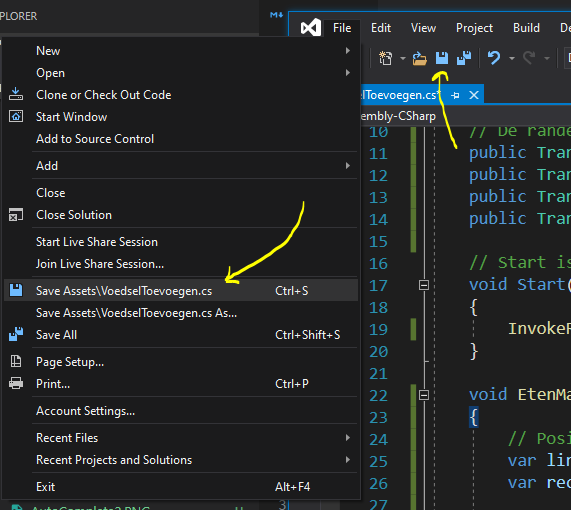

Het volledige script ziet er nu zo uit:
```cs
public class VoedselToevoegen : MonoBehaviour
{
    // Voor het eten
    public GameObject foodPrefab;

    // De randen van het spel
    public Transform borderTop;
    public Transform borderBottom;
    public Transform borderLeft;
    public Transform borderRight;

    // Start is called before the first frame update
    void Start()
    {
        InvokeRepeating(nameof(EtenMaken), 3, 4);
    }

    void EtenMaken()
    {
        // Positie van links en rechts
        var linkerRandX = borderLeft.position.x;
        var rechterRandX = borderRight.position.x;

        // Willekeurige positie tussen links en rechts
        var etenX = (int)Random.Range(linkerRandX, rechterRandX);

        // Positie van boven en onder
        var bovenRandY = borderTop.position.y;
        var onderRandY = borderBottom.position.y;

        // Willekeurige positie tussen boven en onder
        var etenY = (int)Random.Range(bovenRandY, onderRandY);

        // Aanmaken eten
        Instantiate(foodPrefab, new Vector2(etenX, etenY), Quaternion.identity);
    }
}
```

Ga weer terug naar het Unity programma (die staat als het goed is nog ergens open). En klik op de 'Main Camera' in het scene venster.  


Als je nu kijkt in het eigenschappen venster zie je daar het script staan met de variabele die we hadden aangemaakt. Alleen daarachter staat nog 'None'.  
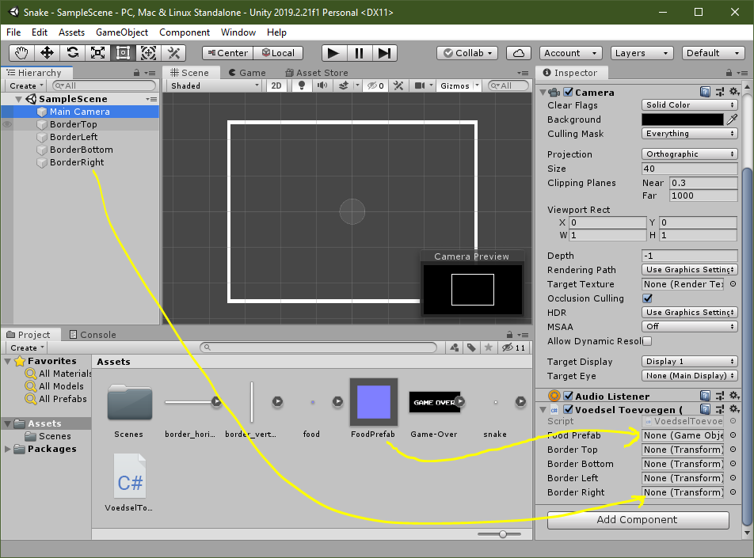
- Sleep nu de **FoodPrefab** vanuit het Assets venster in het vakje waar 'None' staat.
- Sleep nu de randen één voor één in het juiste vakje waar 'None' staat.
Het zou er nu zo uit moeten zien:  
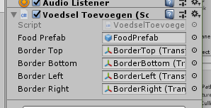

_Als het niet lukt met slepen kan je ook klikken op het kleine rondje achter de variabele. Dan opent een venster waar je kan kiezen wat er in moet komen.  
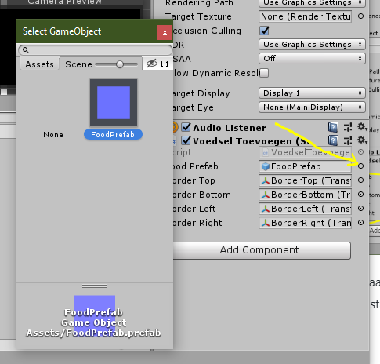_

**Belangrijk:** Sla je project weer even op zoals we eerder hebben gedaan.

### Uittesten

Nu willen we natuurlijk uittesten of het gaat werken. Dus klik nu maar eens op de 'Play' knop boven in beeld:  
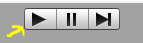.  
Als het goed is zie je nu je spel starten en als je even wacht zouden er vanzelf eten stukjes tevoorschijn moeten komen.

Gelukt? Jippie...:tada:

Klik nog een keertje op de 'Play' knop om weer te stoppen.

## Snake maken

We hebben nu gemaakt dat het eten er is, maar zonder Snake is het spel natuurlijk niet af. Laten we daarom nu Snake gaan toevoegen aan het spel. Het toevoegen van Snake lijkt een beetje op het toevoegen van het eten.

Voor de Snake is al een 'asset' (een plaatje in vakje 3).
- Snake

Dit plaatje is bij hetzelfde als het eten, namelijk een pixel, maar dan wit.

Klik het plaatje 'Snake' aan in het assets vak (3). En zorg dat de eigenschappen goed staan zoals hieronder. Druk daarna op 'Apply'.  
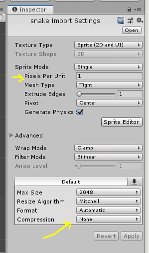

Als dat goed staat dan kan je nu Snake het spel in slepen en hem in het midden van het spel zetten.  
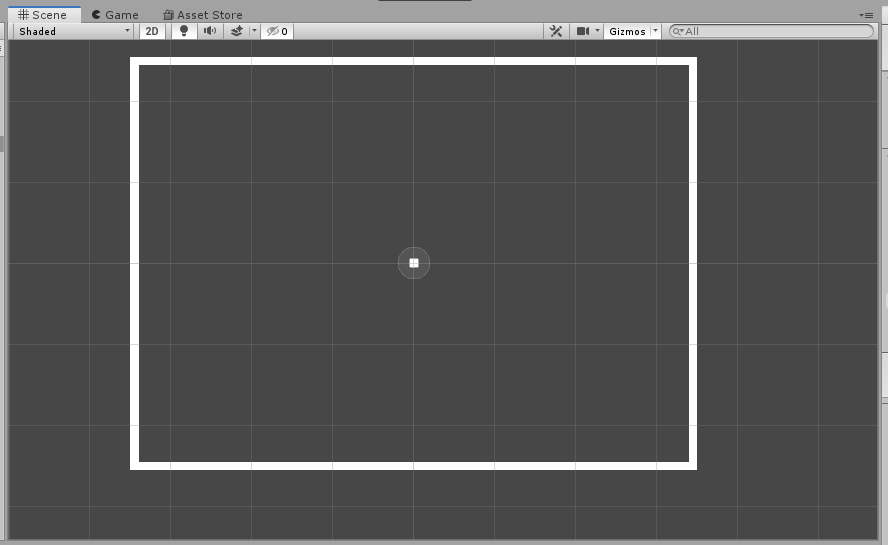

Op dit moment is dit eigenlijk nog geen slang, maar alleen nog maar zijn hoofd. Daarom gaan we hem even hernoemen naar 'Head' (engels voor hoofd).  
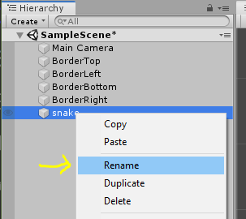
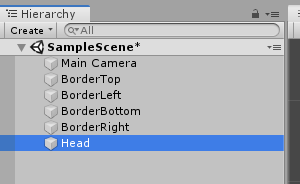

Snake is natuurlijk nog maar een plaatje en zoals we eerder geleerd hadden moet Snake nog onderdeel worden van het spel om echt wat te kunnen doen. Daarop moeten we ook bij Snake een **Box Collider** toevoegen. Weet je nog hoe dat moet?

Nee?

Geeft niet! We leggen het gewoon nog even uit ;-). Klik op het hoofd van snake in het scene venster (1) (_waar je net hernoemd hebt_). Ga dan naar het eigenschappen venster en klik vervolgens op: **Add Component -> Physics 2D -> Box Collider 2D**.

Bij de vorige keren hebben we niks aangepast in het vakje van de **Box Collider**, maar in dit geval moeten we dat wel doen. Pas daarom de eigenschappen aan van de 'Size' naar 0.7 en 0.7. Dit doen we omdat Snake dan dicht langs de muur kan bewegen. Ook hier moeten we de _Is Trigger_ aanzetten.  
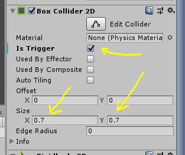

Omdat Snake ook moet bewegen in het spel, moeten we nog wat toevoegen. Namelijk een **Rigidbody**. Een **Rigidbody** is iets wat zorgt voor zwaartekracht, snelheid en beweging. Laten we die dus ook toevoegen aan het 'Head' object door in het eigenschappen venster vervolgs op het volgende te klikken: **Add Component -> Physics 2D -> Rigidbody 2D**. En we gebruiken dan de volgende settings.  
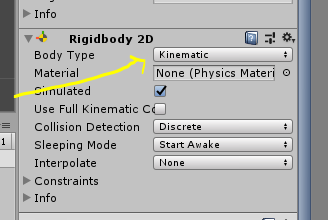

Nu hebben we Snake (zijn hoofd) en eten in het spel. Probeer eens uit met play of het eten ook nog steeds werkt. Sla nu het project weer op zoals je eerder hebt gedaan.

## Snake's lichaam maken

Snake is nu alleen nog maar een hoofd, maar we hebben natuurlijk ook een lichaam nodig. Wij gebruiken eigenlijk hetzelfde als zijn hoofd alleen willen we dat tijdens het spel er aan vast maken. Hiervoor hebben we net als bij het eten een **Prefab** nodig.

Sleep daarom het hoofd van Snake uit het scene venster naar het Assets scherm.  
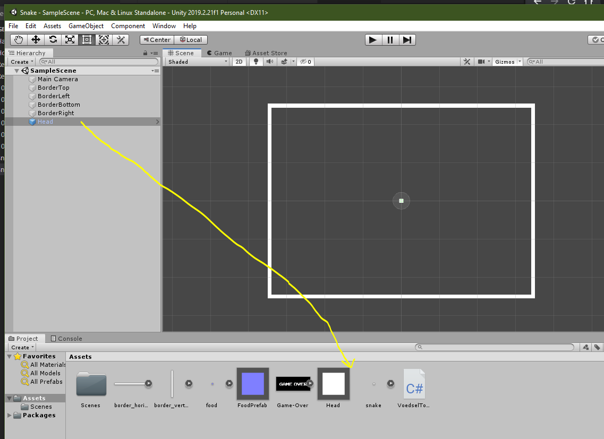

Hernoem nu de 'Head' in het Assets scherm naar 'TailPrefab' (tail betekend staart).  
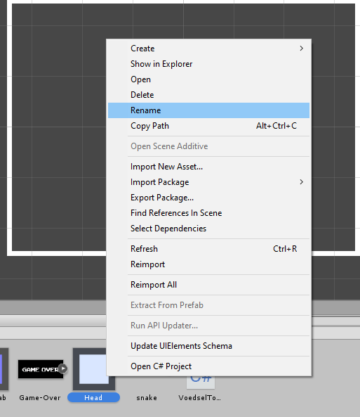

## Snake's hoofd laten bewegen

Ok, nu hebben we de onderdelen voor zijn hoofd in het spel en de onderdelen voor zijn staart in het Assets venster.

Klik weer op het hoofd van Snake. We gaan nu een script toevoegen om weer te kunnen programmeren. Klik in het eigenschappen venster achter elkaar op: **Add Component -> New Script**. Noem het script 'Snake' en klik op 'Create and add'.  
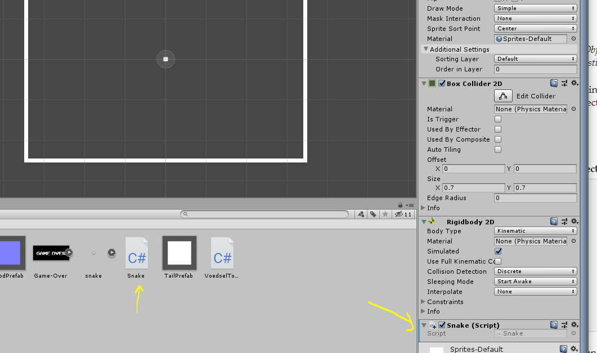

Dubbel klik op het Snake script in het Assets venster. Nu zal Visual Studio weer openen en kan je weer gaan programmeren. Als het goed is ziet het script er zo uit:  
```cs
using System.Collections;
using System.Collections.Generic;
using UnityEngine;

public class Snake : MonoBehaviour
{
    // Start is called before the first frame update
    void Start()
    {
        
    }

    // Update is called once per frame
    void Update()
    {
        
    }
}
```

Omdat ze zometeen nog wat met een lijst moeten doen om de staart in te bewaren voegen we nog een `using` toe:
```cs
using System.Collections;
using System.Collections.Generic;
using UnityEngine;
using System.Linq;

public class Snake : MonoBehaviour
{
    // Start is called before the first frame update
    void Start()
    {
        
    }

    // Update is called once per frame
    void Update()
    {
        
    }
}
```

We gaan nu maken dat Snake altijd een kant op zal gaan. We gebruiken hiervoor weer de **Start()** functie. Maar om Snake te laten bewegen hebben we 2 nieuwe functies nodig. De eerste is de functie **Beweeg()**, deze functie zal er voor zorgen dat Snake elke keer een stukje beweegt. We hebben nog een andere functie nodig die de **Beweeg()** functie aan blijft roepen net zolang we niet game over zijn. Deze nieuwe functie noemen we **BeweegLus()** en deze heeft als 'Return waarde' het type `IEnumerator`, maar voor nu is dat even niet belangrijk wat dat doet.
```cs
void Beweeg() 
{

}

IEnumerator BeweegLus()
{

}
```

_**Letop:** de functies moeten onder de andere functies staan, maar wel **tussen** de `class Snake {` en het einde van die class `}`_

Vanuit de **Start()** functie roepen we de **BeweegLus()** functie aan. Dat doen we met een speciale functie die door Unity gemaakt is. Dit functie heet **StartCoroutine()** en we geven daar de naam van de functie aan mee die hij moet uitvoeren.
```cs
void Start() 
{
    StartCoroutine(nameof(BeweegLus));
}
```

Nu gaan de de echte lus maken die uiteindelijke weer de **Beweeg()** functie moet aanroepen. Hiervoor hebben we een lus nodig. Één van de manier om een lus te maken is met een 'while()' lus. Dit is een lus die elke keer opnieuw begint totdat de variabele die in de 'while()' staat niet meer waar is.  
Voor nu maken we een 'while()' lus die altijd 'waar' (true) is. Maar daarom de 'while' lus aan in de **BeweegLus()** functie.
```cs
IEnumerator BeweegLus()
{
    while(true)
    {
        
    }
}
```

In de lus willen we dat Snake beweegt. Daarom roepen we in de 'while()' lus de functie **Beweeg()** aan.
```cs
IEnumerator BeweegLus()
{
    while(true)
    {
        Beweeg();
    }
}
```

Als we nu niks zouden aanpassen dan gaat Snake heel snel bewegen. En we willen eigenlijk dat hij elke seconde ongeveer 3 stapjes maakt. Daarom roepen we vóórdat we **Beweeg()** aanroepen eerst nog een functie aan die wacht voor het aantal seconden wat we meegeven. (_Dit ziet er een beetje vreemd uit, maar is te lastig om nu uit te leggen, type het maar gewoon over ;-)).
```cs
IEnumerator BeweegLus()
{
    while(true)
    {
        yield return new WaitForSeconds(0.3f);
        Beweeg();
    }
}
```
In de functie **WaitForSeconds()** geven we de waarde 0.3f mee. Dit betekend dat we 0.3 seconden wachten. En dan de **Beweeg()** functie aanroepen. Dan begint de lus weer opnieuw. Wacht weer 0.3 seconden en roept weer de **Beweeg()** functie aan. En zo blijft dit doorgaan.

Nu wordt dus om de 0.3 seconden de **Beweeg()** functie aangeroepen, maar die doet nog niks. De code van het hele bestand zou er ongeveer zo uit moeten zien:
```cs
using System.Collections;
using System.Collections.Generic;
using UnityEngine;

public class Snake : MonoBehaviour
{
    // Start is called before the first frame update
    void Start()
    {
        StartCoroutine(nameof(BeweegLus));
    }

    // Update is called once per frame
    void Update()
    {
        
    }

    void Beweeg()
    {

    }

    IEnumerator BeweegLus()
    {
        while(true)
        {
            yield return new WaitForSeconds(0.3f);
            Beweeg();
        }
    }
}
```

Laten we nu de **Beweeg()** functie maar eens gaan maken.  
Voor het bewegen moet het spel weten welke kant Snake op aan het bewegen is. Hiervoor voegen we een variabele toe die we 'richting' noemen. _Voor nu laten we hem naar rechts (right in het engels) gaan.
```cs
public class Snake : MonoBehaviour
{
    Vector2 richting = Vector2.right;

    // Start is called before the first frame update
    void Start()
    {
        StartCoroutine(nameof(BeweegLus));
    }

    ...
}
```

In de **Beweeg()** functie kunnen we nu Snake laten bewegen. Omdat we dit script in Unity hebben gekoppeld met het hoofd van Snake, kunnen we in de **Beweeg()** functie 'transform' aanroepen wat eigenlijk zorgt dat het plaatje gaat bewegen.
```cs
void Beweeg()
{
    transform.Translate(richting);
}
```

_Wat de **Translate()** functie doet is eigenlijk zeggen 'Voeg deze richting toe aan de plek waar ik nu ben'. Dus elke keer dat het wordt aangeroepen met 'right' zal Snake dus een plekje naar rechts opschuiven._

**Belangrijk** sla het bestand op in Visual Studio weer op zoals je eerder gedaan hebt. 

Open nu weer het Unity programma en klik op de 'Play' knop. Als het goed is zou Snake nu naar rechts moeten bewegen. _Let op Snake gaat ook nog gewoon door de muur heen, maar dat gaan we echt nog wel goed maken ;-)_  
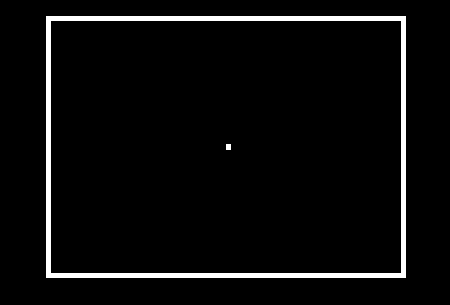

## Het hoofd van Snake besturen

Nu beweegt het hoofd van Snake, maar daar hebben we natuurlijk niet zo heel veel aan. Misschien is het daarom leuk om te gaan maken dat je met de pijltjes toetsen het hoofd kan bewegen. Hiervoor gebruiken we de **Update()** functie die al door Unity gemaakt was.

Hiervoor gebruiken we de 'if' blokjes die we bij het maken van een rekenmachine ook gemaakt hebben. En we willen weten of iemand een toets heeft ingedrukt van de pijltjes. Dit doen we door het aanroepen van een functie **Input.GetKey()** en dan geven we mee welk pijltje we willen controleren:
- KeyCode.RightArrow = pijltje rechts,
- KeyCode.LeftArrow = pijltje links,
- KeyCode.UpArrow = pijltje omhoog,
- KeyCode.DownArrow = pijltje omlaag

Waar we ook rekening mee moeten houden is dat als we links gaan dan we niet in één keer naar rechts kunnen. Als we dus _niet_ links gaan _en_ iemand drukt op de pijl naar rechts, dan zetten we de variabele 'richting' op rechts (right). Daarom ziet één afzonderlijk stukje er zo uit:
```cs
    if (Input.GetKey(KeyCode.RightArrow) && richting != Vector2.left)
        richting = Vector2.right;
```

Als we dit voor alle richtingen doen dan krijgen we de volgende code in de **Update()** functie.
```cs
void Update()
{
    if (Input.GetKey(KeyCode.RightArrow) && richting != Vector2.left)
        richting = Vector2.right;
    else if (Input.GetKey(KeyCode.LeftArrow) && richting != Vector2.right)
        richting = Vector2.left;
    else if (Input.GetKey(KeyCode.UpArrow) && richting != Vector2.down)
        richting = Vector2.up;
    else if (Input.GetKey(KeyCode.DownArrow) && richting != Vector2.up)
        richting = Vector2.down;
}
```

Sla het bestand weer op in Visual Studio en ga weer naar Unity. Klik in Unity op de 'Play' knop. Als het goed is kan je nu met de pijltjes Snake bewegen door het veld. 

Doordat je nu met de pijltjes toets de waarde van de variabele `richting` veranderd zal elke keer dat de **Beweeg()** functie uitgevoerd worden gekeken worden welke kan Snake die keer op moet.

Sla nu ook in Unity het project weer op zodat we zeker weten dat we later weer verder kunnen.

## Staart van Snake

Laten we nu eens gaan nadenken over de staart van Snake. Stel Snake heeft een kop (H) en 3 staart delen (S).
```sh
SSSH
```

De computer kan per keer maar één dingen doen. Als nu het hoofd van Snake naar rechts gaat bewegen dan zou het logisch zijn om zijn staart erachter aan te laten bewegen op de volgende manier. 
```sh
stap 1: SSSH    snake heeft nog niet bewogen
stap 2: SSS H   snake zijn hoofd is naar rechts bewogen
stap 3: SS SH   snake zijn eerste staart stukje beweegt ook naar rechts
stap 4: S SSH   snake zijn tweede staart stukje beweegt ook naar rechts
stap 5:  SSSH   snake is nu in zijn geheel naar rechts geschoven
```

Om Snake te bewegen zijn er dus voor de computer 5 stappen nodig. Weet jij misschien een manier om voor de computer in maar 3 stappen heel snake te bewegen?

Lees nog even niet verder, probeer eerst zelf eens een oplossing te bedenken.

<div class="page-break"></div>

Ok, heb je wat bedacht? Ik ben erg benieuwd. Schrijf daarom hieronder je oplossing op op de zelfde manier als dat we met de 5 stappen deden. Hieronder alvast stap 1. 

```sh
stap 1: SSSH    snake heeft nog niet bewogen


```

Heb je geen oplossing of heb je wel een oplossing en deze opgeschreven ga dan naar de volgende bladzijde.

<div class="page-break"></div>

Dit is de oplossing om in 3 stappen hetzelfde te doen als in 5 stappen:
```sh
stap 1: SSSH    snake heeft nog niet bewogen
stap 2: SSS H   snake zijn hoofd heeft bewogen
stap 3:  SSSH   snake zijn achterste stukje stoppen we in het gat. 
```

Dit is voor de computer dus veel makkelijker om te doen dan elk stukje staart te bewegen. Het maakt hierdoor ook niet uit hoelang de staart is.

Om dit te maken moeten we een lijstje bij gaan houden met staartstukjes. Open daarom weer in Visual Studio de code voor Snake door dubbel te klikken op 'Snake' in het assets venser.  


We gaan nu vlak onder de variabele 'richting' (boven in de class) een nieuwe variabele maken. Hierin gaan we een lijstje bij houden van de staartdelen.
```cs
public class Snake : MonoBehaviour
{
    Vector2 richting = Vector2.right;
    List<Transform> staartstukjes = new List<Transform>();

    ...
}
```

We hebben nu een `List` gemaakt (lijst in het engels), en zeggen tegen de computer dat in die lijst objecten komen van het type `Transform`. En een `Transform` was iets waaraan we positie konden geven, zoals dus ook nodig is bij de staart stukjes.

Omdat we wat functies willen gebruiken die nodig zijn om informatie te vragen aan de lijst is het nodig om bovenin het bestand nog een bibliotheek toe te voegen. Voeg daar `using System.Linq;` aan toe
```cs
using System.Collections;
using System.Collections.Generic;
using UnityEngine;
using System.Linq;    // <-- Deze is nieuw
```

Dan moeten we nu de logica maken die we net bedacht hebben om de staart te bewegen. Zorg ervoor dat de **Beweeg()** functie er zo uit gaat zien:
(_het commentaar in code hoef je niet over te typen he ;-)_)
```cs
void Beweeg()
{
    // We slaan eerst de vorige positie van het hoofd op
    Vector2 vorigePositieHoofd = transform.position;

    // Nu bewegen we het hoofd (en ontstaat er een gat als we een staart hebben)
    transform.Translate(richting);

    // Controleren of we een staart hebben
    if(staartstukjes.Any())
    {
        // Pak het laatste staartstukje en geef het de positie waar het hoofd was
        staartstukjes.Last().position = vorigePositieHoofd;

        // Zet het laatste stukje in de lijst als eerste in de lijst
        staartstukjes.Insert(0, staartstukjes.Last());

        // Haal het staartstukje aan het einde weg
        staartstukjes.RemoveAt(staartstukjes.Count - 1);
    }
}
```

Ik heb geprobeerd in het commentaar te zetten wat er gedaan wordt, maar hieronder even een opsomming van de stappen:
1. Vorige positie van hoofd moeten we even opslaan
2. Hoofd bewegen
3. Kijken of we staart stukjes hebben
4. Positie (in het spel) van laatste staartstukje veranderen in de positie van het hoofd
5. Laatste staart stukje in de lijst stoppen als eerste stukje (_we vullen nu het gat op, maar dit stukje zit nu 2x in de lijst_)
6. Uit de lijst het laatste stukje weghalen.

## Snake voeren zodat zijn staart langer wordt

We hebben nu een stukje code gemaakt om te zorgen dat de staart van Snake zijn hoofd volgt. Maar zolang Snake niet kan eten gebeurt er natuurlijk weinig.

Wat we gaan doen is het volgende:
1. Functie maken die aangeroepen wordt door het spel wanneer Snake in aanraking komt met een stukje eten
2. Snake langer maken wanneer hij een stukje eet

Voor het langer worden van Snake gebruiken we dezelfde techniek als bij zijn staart. Hieronder en voorbeeld met Snake zijn hoofd (H), zijn staart (S) en eten (E):
```sh
stap 1: SSSH E      // Snake is bijna bij het eten
stap 2: SSS HE      // Snake zijn hoofd is bewogen
stap 3:  SSSHE      // Snakes laatste staartstukje is verplaatst
stap 4:  SSS H      // Snake zijn hoofd is over het eten heen
stap 5:  SSSSH      // We voegen een nieuwe stukje staart toe 
                    // in het gat wat is onstaan.
```

Wat we nu eerst nodig hebben is nu weer een extra variabele om bij de houden of Snake wat gegeten heeft. Voeg daarom onder de 'staartstukjes' variabele 'gegeten' toe. 'gegeten' zetten we gelijk op 'false' (_niet waar, dus niet gegeten_):
```cs
public class Snake : MonoBehaviour
{
    Vector2 richting = Vector2.right;
    List<Transform> staartstukjes = new List<Transform>();
    bool gegeten = false;

    ...
}
```

Ook hebben we een variable nodig om nieuwe staart stukjes toe te kunnen voegen 'staartPrefab'. De code ziet er dan zo uit:
```cs
public class Snake : MonoBehaviour
{
    Vector2 richting = Vector2.right;
    List<Transform> staartstukjes = new List<Transform>();
    bool gegeten = false;

    public GameObject staartPrefab;
}
```

### Eten opeten

We hebben net 2 variabelen toegevoegd. Één om te weten dat Snake gegeten heeft en één om te weten hoe de staartstukjes er uit zien.  
Nu moeten we natuurlijk nog zorgen dat we ook weten dat Snake echte gegeten heeft. Hiervoor hebben we eerder in de opdracht **Box Colliders** gemaakt voor de stukjes eten en voor Snake zijn hoofd. Als nu het hoofd van Snake tegen een eten stukje aankomt dan wordt door Unity de functie **OnTriggerEnter2D()** aangeroepen. Dat doet Unity alleen als de functie er ook is. Die moeten we nu dus aanmaken.
```cs
private void OnTriggerEnter2D(Collider2D gebotstMet)
{
    // Is Snake gebotst met FoodPrefab
    if (gebotstMet.name.StartsWith("FoodPrefab"))
    {
        // Snake heeft gegeten
        this.gegeten = true;

        // Het eten weghalen uit het spel
        Destroy(gebotstMet.gameObject);
    }
    else
    {
        // Je bent met iets anders gebotst.. 
        Time.timeScale = 0; // Stop het spel
    }
}
```

Even een korte uitleg van wat we nou gedaan hebben. In Unity hebben we een object gemaakt (eerder in de opdracht) voor het eten. Dat object heeft 'FoodPrefab'  
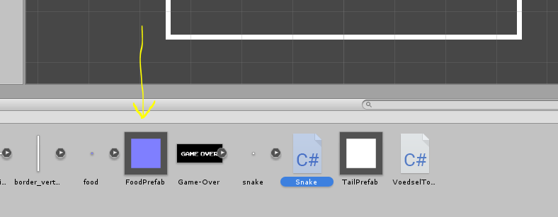

Nu weten we dat Snake gegeten heeft en als hij eet dan verwijderen we de stukje eten weer uit het spel. Met de **Destroy()** functie wordt het stukje eten verwijderd. (_Destroy betekend vernietigen in het engels_)

Wanneer je met iets anders botst (_dat is dan je staart of de rand van het spel_) dan stoppen we het hele spel. Doordat we de tijd stil zetten. Er zijn natuurlijk allemaal andere manieren om het spel te laten stoppen, maar voor nu is dit het makkelijkst.

Nu hebben we er dus voor gezorgd dat we weten wanneer Snake gegeten heeft. We moeten nu alleen nog maken dat tijdens het bewegen er een stukje staart bij komt. Dit doen we in de **Beweeg()** functie gaan we een stukje code toevoegen net boven de **if(staartstukjes.Any())** die er staat. Het stuk code ziet er zo uit (_kijk verder voor hoe de hele functie eruit ziet_):
```cs
void Beweeg()
{
    ....

    // Heeft Snake gegeten? Dan moeten we extra stukje staart maken
    if(gegeten)
    {
        // Stukje staart inladen in het spel en op de vorige postitie
        // van het hoofd neerzetten
        GameObject staart = (GameObject)Instantiate(
            staartPrefab,
            vorigePositieHoofd,
            Quaternion.identity);

        // Ook het stukje toevoegen aan de lijst met staart stukjes
        staartstukjes.Insert(0, staart.transform);

        // En weer laten weten dat Snake weer kan eten
        gegeten = false;
    }

    ....
}
```

De functie **Beweeg()** ziet er als het goed is nu zo uit:

```cs
void Beweeg()
{
    // We slaan eerst de vorige positie van het hoofd op
    Vector2 vorigePositieHoofd = transform.position;

    // Nu bewegen we het hoofd (en ontstaat er een gat als we een staart hebben)
    transform.Translate(richting);

    // Heeft Snake gegeten? Dan moeten we extra stukje staart maken
    if(gegeten)
    {
        // Stukje staart inladen in het spel en op de vorige postitie
        // van het hoofd neerzetten
        GameObject staart = (GameObject)Instantiate(
            staartPrefab,
            vorigePositieHoofd,
            Quaternion.identity);

        // Ook het stukje toevoegen aan de lijst met staart stukjes
        staartstukjes.Insert(0, staart.transform);

        // En weer laten weten dat Snake weer kan eten
        gegeten = false;
    }
    // Controleren of we een staart hebben
    if(staartstukjes.Any())
    {
        // Pak het laatste staartstukje en geef het de positie waar het hoofd was
        staartstukjes.Last().position = vorigePositieHoofd;

        // Zet het laatste stukje in de lijst als eerste in de lijst
        staartstukjes.Insert(0, staartstukjes.Last());

        // Haal het staartstukje aan het einde weg
        staartstukjes.RemoveAt(staartstukjes.Count - 1);
    }
}
```

Nu zie je twee keer een **if()** staan, maar dat klopt eigenlijk niet. Want wat er nu gebeurt is het volgende:

- Snake beweegt
- Heeft Snake gegeten?
  - Ja: Voeg nieuwe stukje staart toe
- Heeft Snake staart stukjes?
  - Ja: Verplaats het laatst stukje staart naar de plek waar net het hoofd van Snake zat.

Op het eerste gezicht lijkt dit misschien te kloppen, maar als we even verder nadenken, klopt het toch niet. Want het laatste stukje staart verplaatsen naar waar Snake zijn hoofd zat, dat hoeft alleen als we bewegen en niet als we gegeten hebben. Daarom moeten we de **else** gebruiken. 

We hebben eerder geleerd dat een **if()** eigenlijk **als?** betekend. Dus `if(gegeten)` betekent eigenlijk: `als Snake gegeten heeft dan...`. Maar nu willen we maken: `als Snake gegeten heeft dan ... en anders ...`. En precies voor het stukje `en anders ...` is de **else** uitgevonden.

We gaan daarom de code een heel klein beetje veranderen namelijk:
```cs
if(staartstukjes.Any())
```
Moet je veranderen in:
```cs
else if(staartstukjes.Any())
```

De hele functie ziet er dan nu zo uit:
```cs
void Beweeg()
{
    // We slaan eerst de vorige positie van het hoofd op
    Vector2 vorigePositieHoofd = transform.position;

    // Nu bewegen we het hoofd (en ontstaat er een gat als we een staart hebben)
    transform.Translate(richting);

    // Heeft Snake gegeten? Dan moeten we extra stukje staart maken
    if(gegeten)
    {
        // Stukje staart inladen in het spel en op de vorige postitie
        // van het hoofd neerzetten
        GameObject staart = (GameObject)Instantiate(
            staartPrefab,
            vorigePositieHoofd,
            Quaternion.identity);

        // Ook het stukje toevoegen aan de lijst met staart stukjes
        staartstukjes.Insert(0, staart.transform);

        // En weer laten weten dat Snake weer kan eten
        gegeten = false;
    }
    // Controleren of we een staart hebben
    else if(staartstukjes.Any())
    {
        // Pak het laatste staartstukje en geef het de positie waar het hoofd was
        staartstukjes.Last().position = vorigePositieHoofd;

        // Zet het laatste stukje in de lijst als eerste in de lijst
        staartstukjes.Insert(0, staartstukjes.Last());

        // Haal het staartstukje aan het einde weg
        staartstukjes.RemoveAt(staartstukjes.Count - 1);
    }
}
```

Sla je code weer op in Visual Studio zoals je eerder al hebt moeten doen.

We hebben nu heel wat code gemaakt. Nu is het bijna tijd om het uit te testen. Maar er mist nog één ding. Namelijk aan de computer laten weten welk onderdeel bij de Staart hoort. We hebben eerder al in Unity een _TailPrefab_ gemaakt (zie plaatje) en deze moeten we koppelen aan de variabele _StaartPrefab_ die in de code hierboven staat.

Selecteer daarom eerst in Unity het hoofd van Snake  
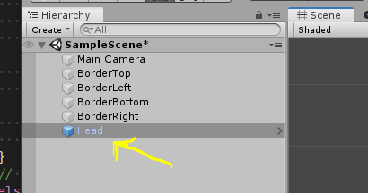

Klik daarna in het eigenschappen venster op het kleine ronde knopje om een Staart te koppelen.  
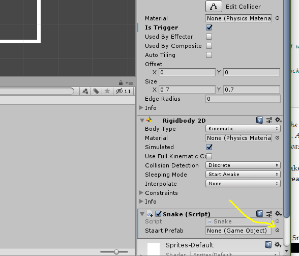

In het schermpje wat er dan komt kies je de _TailPrefab_.  
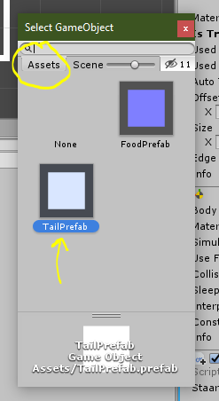

Start nu het spel opnieuw en als het goed is kan je Snake bewegen. Kan je stukjes opeten en wordt Snake dan langer. En als je tegen de muur botst of tegen je eigen staart, dan ben je af en stopt het spel.

De volledige code van Snake script zou er ongever zo uit moeten zien:
```cs
using System.Collections;
using System.Collections.Generic;
using UnityEngine;
using System.Linq;

public class Snake : MonoBehaviour
{
    Vector2 richting = Vector2.right;
    List<Transform> staartstukjes = new List<Transform>();
    bool gegeten = false;
    
    public GameObject staartPrefab;

    // Start is called before the first frame update
    void Start()
    {
        StartCoroutine(nameof(BeweegLus));
    }

    // Update is called once per frame
    void Update()
    {
        if (Input.GetKey(KeyCode.RightArrow) && richting != Vector2.left)
            richting = Vector2.right;
        else if (Input.GetKey(KeyCode.LeftArrow) && richting != Vector2.right)
            richting = Vector2.left;
        else if (Input.GetKey(KeyCode.UpArrow) && richting != Vector2.down)
            richting = Vector2.up;
        else if (Input.GetKey(KeyCode.DownArrow) && richting != Vector2.up)
            richting = Vector2.down;
    }

    void Beweeg()
    {
        // We slaan eerst de vorige positie van het hoofd op
        Vector2 vorigePositieHoofd = transform.position;

        // Nu bewegen we het hoofd (en ontstaat er een gat als we een staart hebben)
        transform.Translate(richting);

        // Heeft Snake gegeten? Dan moeten we extra stukje staart maken
        if(gegeten)
        {
            // Stuke staart inladen in het spel en op de vorige postitie
            // van het hoofd neerzetten
            GameObject staart = (GameObject)Instantiate(
                staartPrefab,
                vorigePositieHoofd,
                Quaternion.identity);

            // Ook het stukje toevoegen aan de lijst met staart stukjes
            staartstukjes.Insert(0, staart.transform);

            // En weer laten weten dat Snake weer kan eten
            gegeten = false;
        }
        // Controleren of we een staart hebben
        else if (staartstukjes.Any())
        {
            // Pak het laatste staartstukje en geef het de positie waar het hoofd was
            staartstukjes.Last().position = vorigePositieHoofd;

            // Zet het laatste stukje in de lijst als eerste in de lijst
            staartstukjes.Insert(0, staartstukjes.Last());

            // Haal het staartstukje aan het einde weg
            staartstukjes.RemoveAt(staartstukjes.Count - 1);
        }
    }

    IEnumerator BeweegLus()
    {
        while(true)
        {
            yield return new WaitForSeconds(0.3f);
            Beweeg();
        }
    }

    private void OnTriggerEnter2D(Collider2D gebotstMet)
    {
        // Is Snake gebotst met FoodPrefab
        if (gebotstMet.name.StartsWith("FoodPrefab"))
        {
            // Snake heeft gegeten
            this.gegeten = true;

            // Het eten weghalen uit het spel
            Destroy(gebotstMet.gameObject);
        }
        else
        {
            // Je bent met iets anders gebotst.. 
            Time.timeScale = 0; // Stop het spel
        }
    }
}
```

Gefeliciteerd! Je hebt in een aantal opdrachten nu geleerd hoe je kan programmeren. Natuurlijk is er nog veel meer te leren, maar hopelijk heb je een beetje een gevoel bij wat je gedaan hebt.

Nu komt misschien nog wel het leukste.. dat is lekker zelf bezig zijn en dingen verzinnen.

---

Als je nog tijd hebt of het leuk vindt om dingen uit te proberen hieronder nog een aantal 

### 1. Snake sneller laten gaan: 
Probeer eens het getal in `WaitForSeconds` aan te passen en kijk wat er gebeurt.

### 2. Snake steed een beetje sneller laten gaan:
Voor het maken van het eten hebben we gebruik gemaakt van de functie:  
```cs
InvokeRepeating(nameof(EtenMaken), 3, 4);
```
Misschien weet je het nog, deze functie roept na 3 seconden de functie **EtenMaken()** aan en daarna wacht hij elke keer 4 seconden en roept hij weer de functie **EtenMaken()** aan.

Deze `InvokeRepeating` kunnen we ook gebruiken om het spel steeds een beetje sneller te laten gaan.

Eerst moeten we een variabele aan maken voor de snelheid van het spel. 
```cs
float snelheid = 0.3f;
```
Zet deze onder de variabele 'gegeten' neer:
```cs
public class Snake : MonoBehaviour
{
    Vector2 richting = Vector2.right;
    List<Transform> staartstukjes = new List<Transform>();
    bool gegeten = false;
    float snelheid = 0.3f;
    
    public GameObject staartPrefab;

    ...
}
```

Pas de code van de `WaitForSeconds` aan in het volgende:
```cs
IEnumerator BeweegLus()
{
    while(true)
    {
        yield return new WaitForSeconds(snelheid);
        Beweeg();
    }
}
```

Maak nu een extra functie aan die we **VerhoogSnelheid()** noemen:  
```cs
void VerhoogSnelheid()
{
    this.snelheid = this.snelheid * 0.8f;
}
```

Deze functie veranderd de inhoud van snelheid door elke keer de snelheid keer 0.8 te doen.

Pas nu de **Start()** functie aan door met `InvokeRepeating` de **VerhoogSnelheid()** functie aan te roepen.
```cs
void Start()
{
    this.timeToMove = .3f;
    //InvokeRepeating(nameof(Move), .3f, .2f);
    StartCoroutine(nameof(MoveRoutine));
    InvokeRepeating(nameof(VerhoogSnelheid), 1, 10);
}
```

Hierboven staat dus dat na 1 seconden en daarna elke 10 seconden de snelheid van snake wordt aangepast door de functie **VerhoogSnelheid()** aan te roepen.

Sla het spel op en test het uit.


